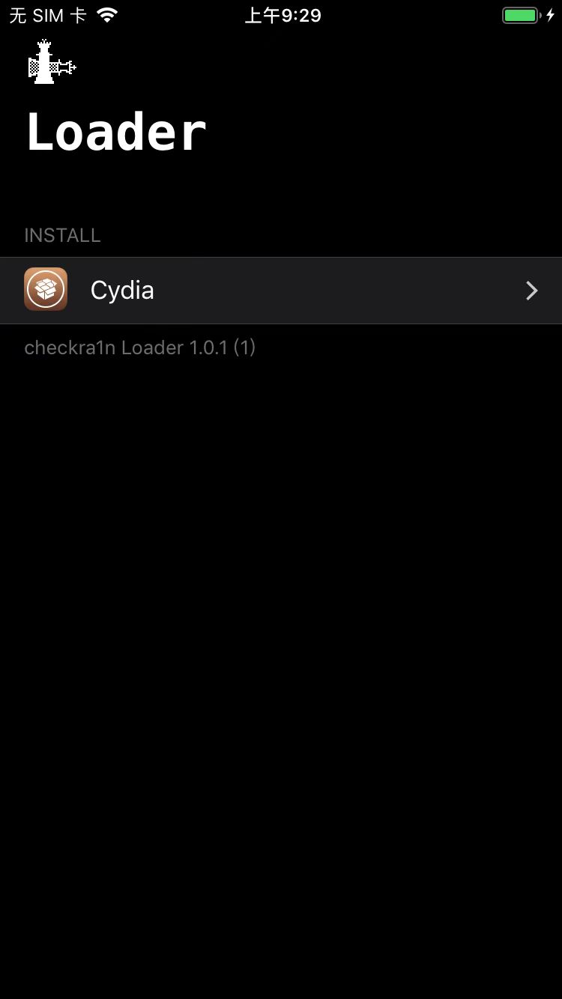
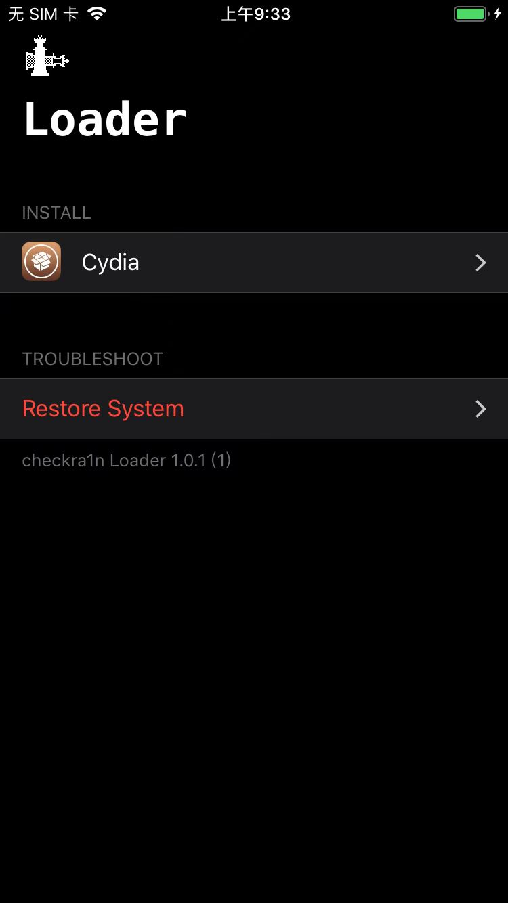
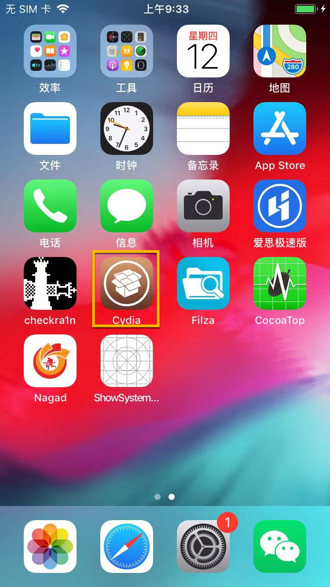
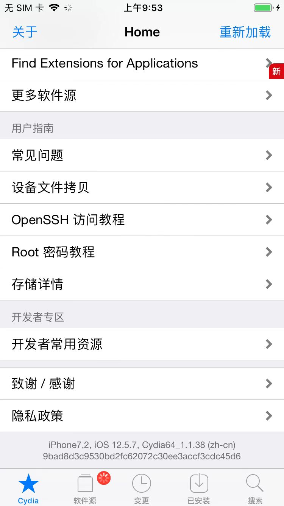

# checkra1n越狱后

* 安装Cydia
  * 原因：越狱后的iPhone，要安装和管理各种常见Tweak=插件，往往最常用的（也是最老的工具之一）是：`Cydia`，所以要先去checkra1n中安装`Cydia`

## 心得

### 如何判断是否已正常安装Cydia

* 打开checkra1n后，checkra1n的app内部：
  * 如果是
    * 没有显示：`Restore System`
      * 
    * 则说明是:没有正常越狱 == 此时还没有安装Cydia == 还没有彻底的真正的完整的越狱
      * 此时需要去：重新安装Cydia
        * 概述：`checkra1n`-》`Cydia`-》`Install Cydia`-》继续安装即可
        * 详见：[安装Cydia](../../after_jailbreak/checkra1n/install_cydia.md)
  * 与之对比：正常安装完毕Cydia后 = checkra越狱正常后
    * checkra1n中是能看到`Restore System`的
      * 
    * 关于：Cydia
      * 桌面上，正常也会出现Cydia的图标的
        * 
      * 也是可以正常打开Cydia的
        * 
