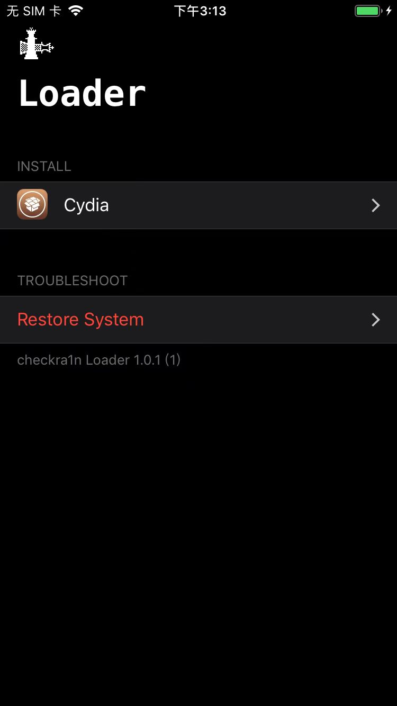

# checkra1n的app使用

## Restore System

checkra1n中有个功能：

* `Restore System`
  * 作用
    * `还原系统`==卸载checkra1n的越狱（和之前相关的内容，比如之前已安装的Cydia等）
  * 界面
    * 

点击`Restore System`，会出现弹框：

继续点击弹框中的`Restore System`

最后可以还原iPhone内容：此处至少是，卸载了checkra1n和之前已安装的Cydia：

