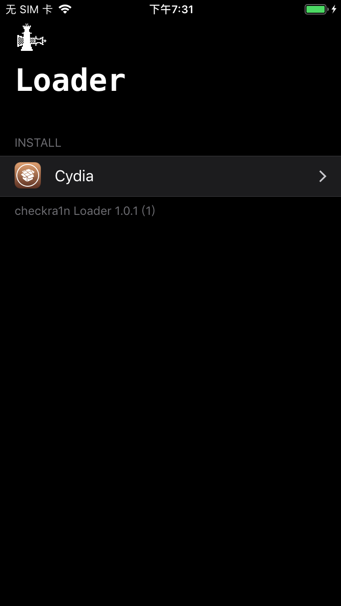
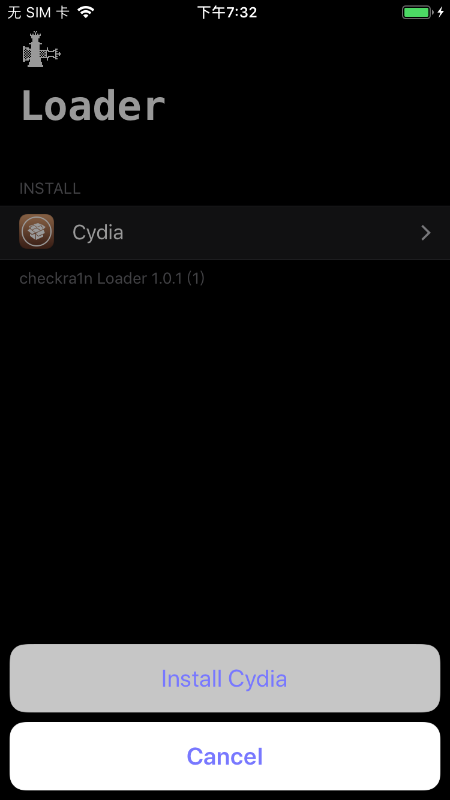
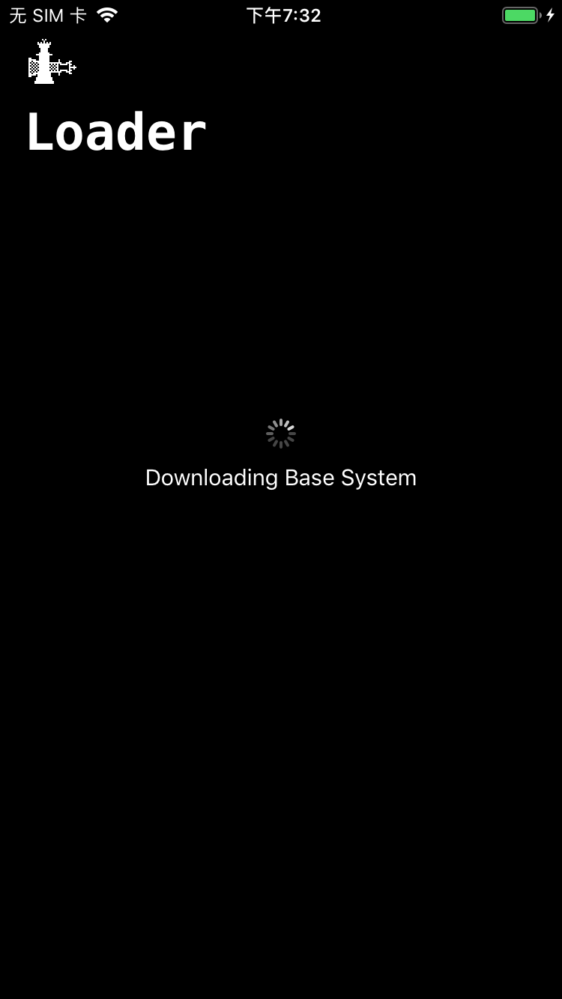
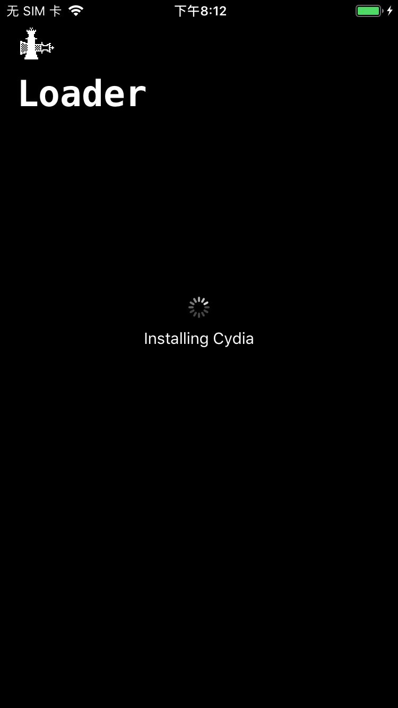
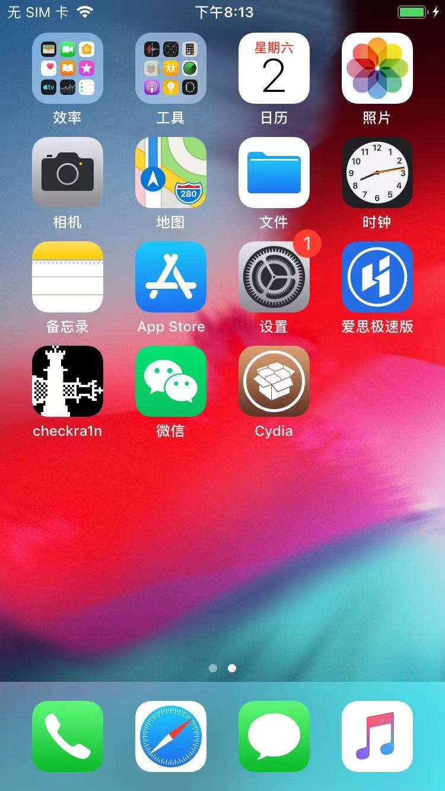
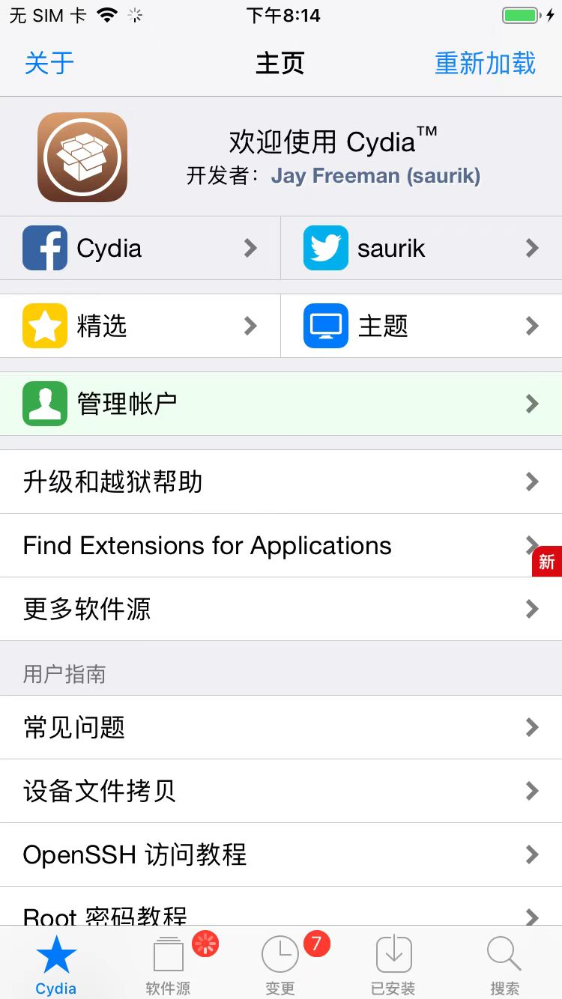
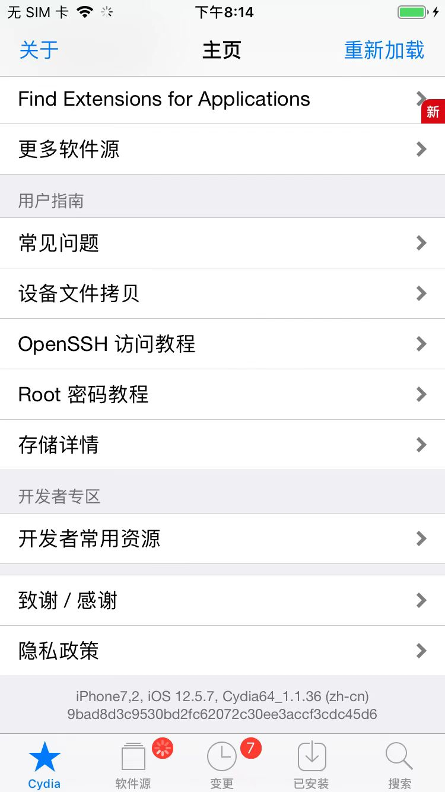
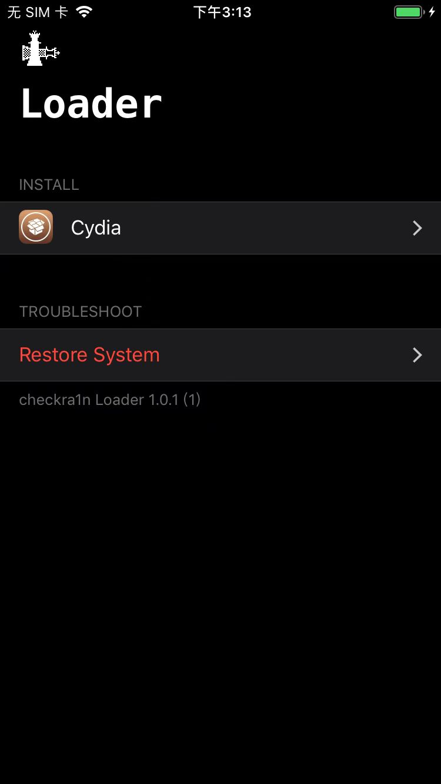
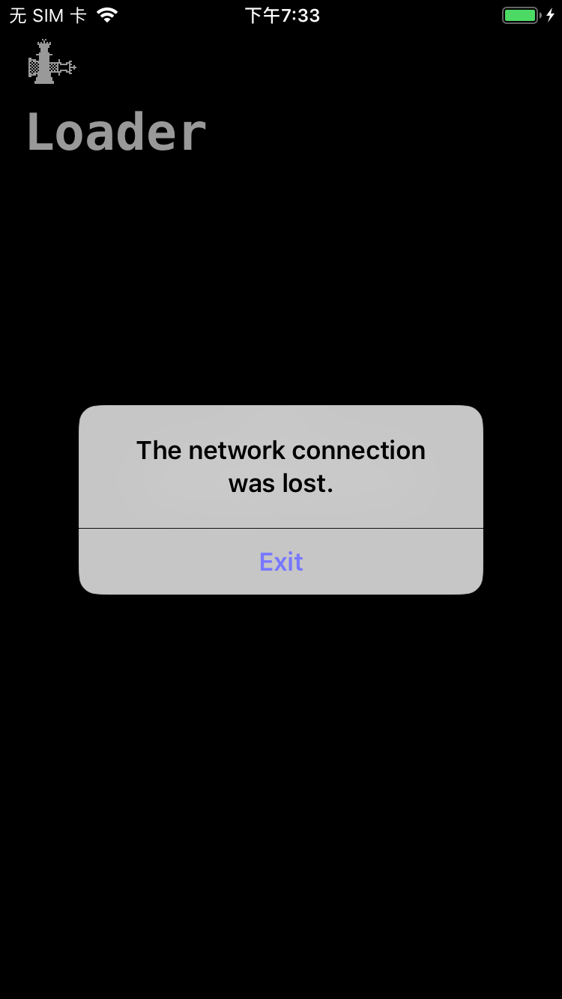
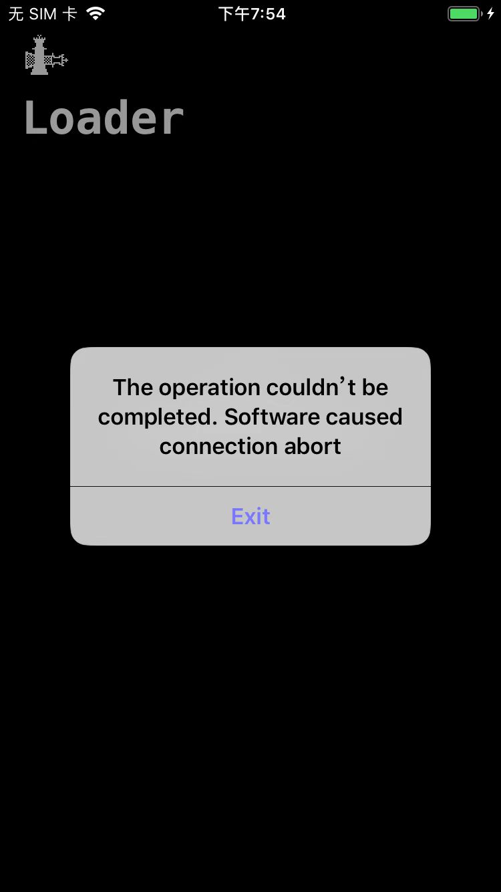

# 安装Cydia

* checkra1n的app中安装Cydia
  * 概述
    * `checkra1n`->`INSTALL`->`cydia`->`Install Cydia`->iPhone桌面中出现安装好的`Cydia`

详解：

## checkra1n的app中安装Cydia

用checkra1n越狱后，iPhone中打开checkra1n后，会看到：



点击`INSTALL`->`Cydia`，弹框：



点击`Install Cydia`，开始安装：

```bash
Downloading Base System
```



正常的话，即可继续顺利安装

```bash
Installing Cydia
```



最终安装好Cydia

然后桌面上即可看到Cydia的logo图标：



打开即可正常看到Cydia的主页：





另外，再回来打开checkra1n，才会额外出现：`Restore System`



## 常见问题

### checkra1n中安装cydia报错：The network connection was lost

* 现象

有时候会遇到，checkra1n安装Cydia期间，弹框报错：

```bash
The network connection was lost
Exit
```



或其他类似的错误：

```bash
The operation couldn't be completed. Software caused connection abort
Exit
```



* 原因：网络偶尔异常
* 解决办法：多试几次
  * 万一不行，想办法翻墙试试
