# unc0ver越狱后

用unc0ver给iPhone越狱后，重启后，即可完成越狱。

## 【首次】初始化Substitute

iPhone重启后，往往会看到：

锁屏界面显示：

* `Substitute  - request for permission`
  * 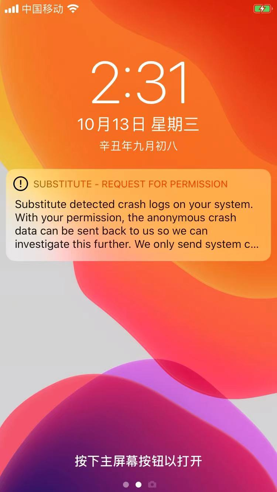
  * 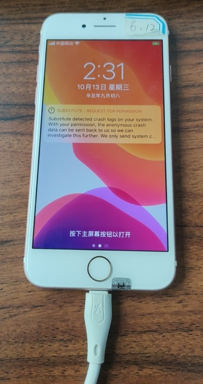

解锁后，点击：Always Allow

* 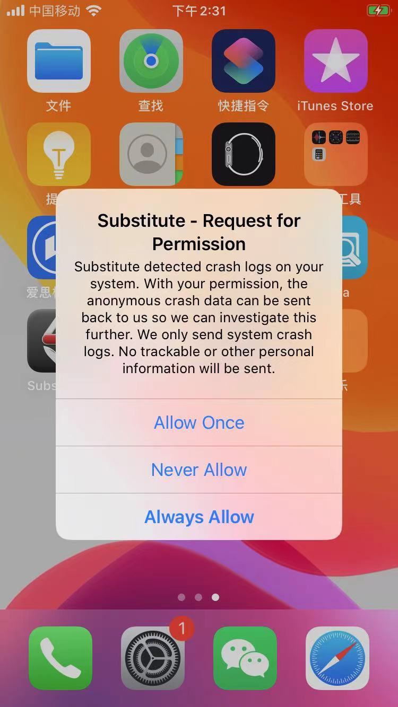

注：有时候是，此弹框，会出现unc0ver越狱期间：

* 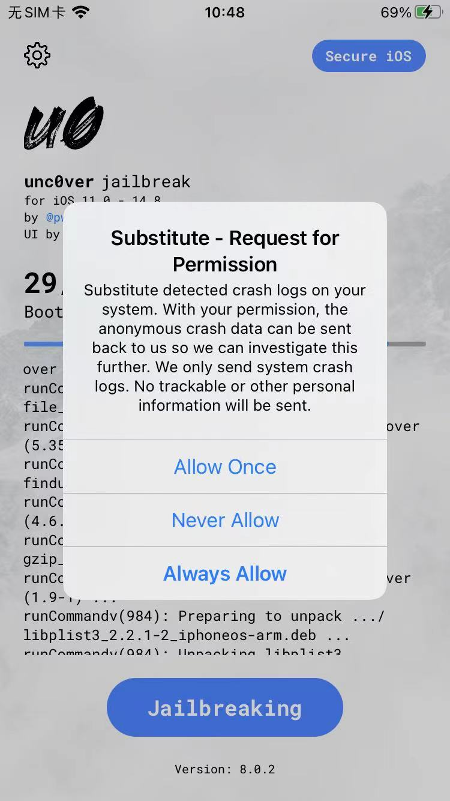

然后点击`Substitute`进入界面，查看到相关设置：

* 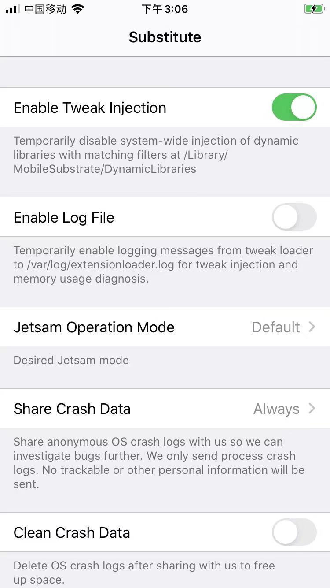
* 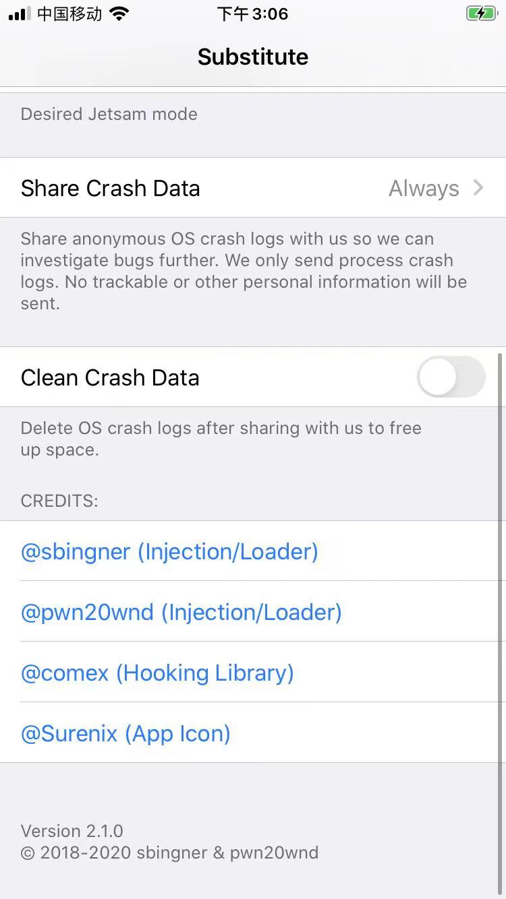

## unc0ver成功越狱后的效果

* 用unc0ver越狱成功后
  * 越狱成功后的桌面：有了`unc0ver`和`Substitute`
    * 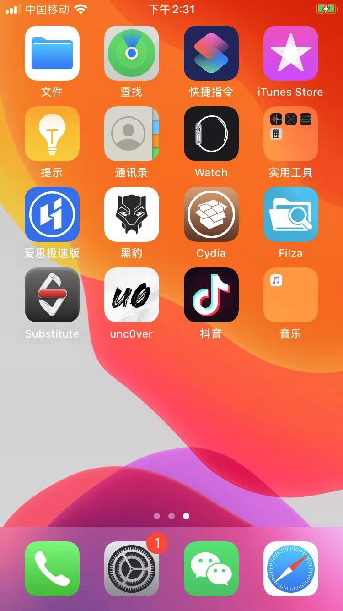
  * 打开unc0ver后会显示：已越狱
    * 旧版unc0ver显示：`Re-Jailbreak` 
      * 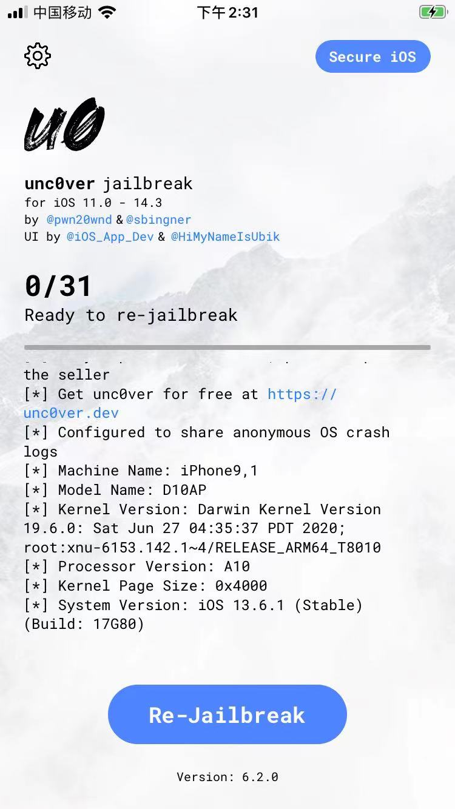
    * 新版unc0ver显示：`Jailbroken`
      * iOS 14.3的iPhone8，用unc0ver 8.0.2越狱后
        * 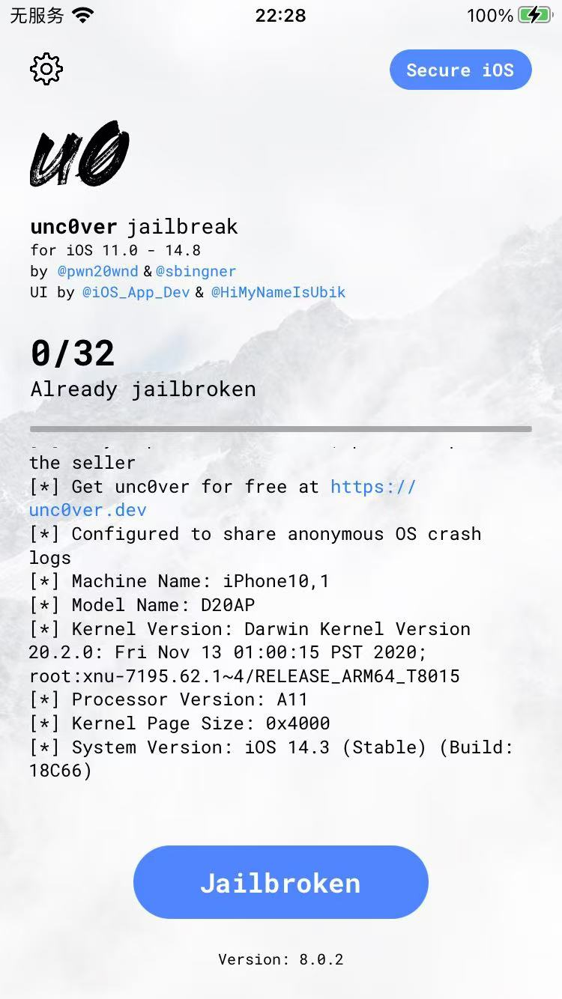
  * 爱思助手检测到iPhone是：已越狱
    * iPhone8
      * 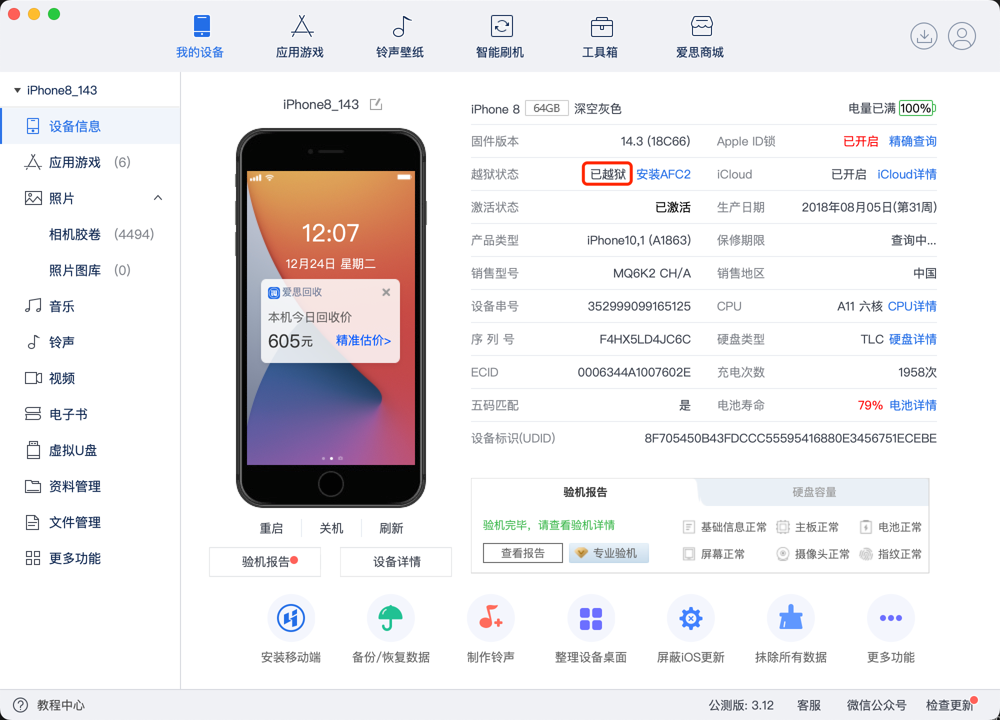
  * 其他越狱工具能正常打开
    * 对比：如果越狱失败，则打开对应工具会闪退崩溃
    * Cydia
      * 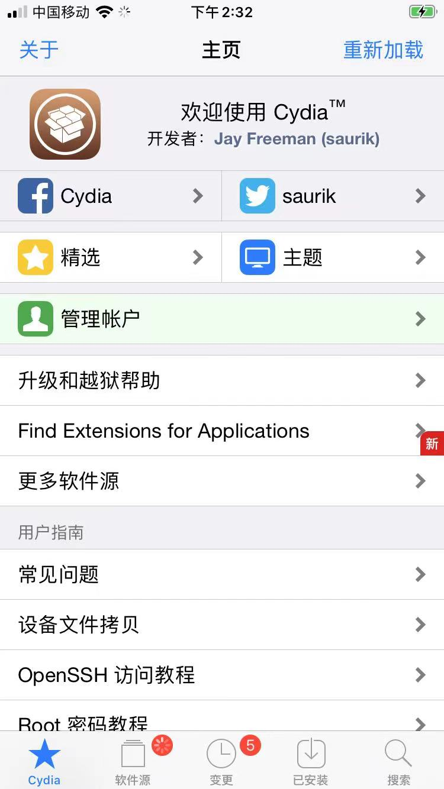
      * 
        * `iPhone9,1`
        * `iOS 13.6.1`
        * `Cydia64_1.1.36(zh-cn)`
