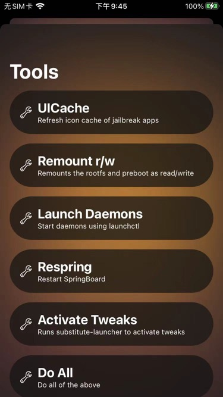

# respring

* `Respring`=`Reboot SpringBoard`=重启桌面=注销

iOS系统内有个默认的，自带的应用：`SpringBoard`

也就是你所看到的：`iPhone的桌面`

每次安装越狱插件，为了使得越狱插件生效，则需要，重启桌面，也就是Respring

常见的重启桌面的方式有：

* 图形界面操作
  * `Filza`安装ipa后-》`右上角`-》`动作`-》`注销`（==`Respring`）
  * palera1n越狱后，`palera1n的app`中-》`Tools`->`Respring`
    * 
  * XinaA15越狱后，`XinaA15`的app中->`注销`=`Respring`
    * 
* 命令行操作：
  * 进入命令行方式
    * Mac中通过ssh进入iPhone的命令行
    * iPhone中通过终端类插件进入命令行
  * 具体命令
    * `killall SpringBoard`
