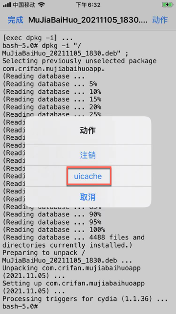
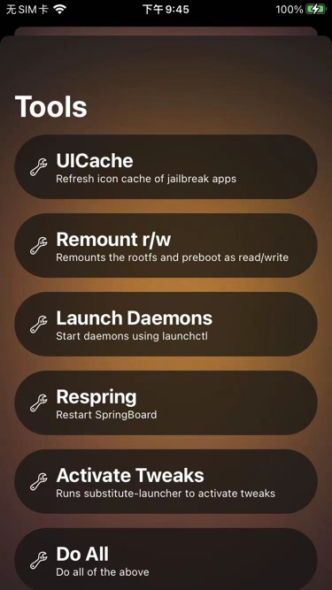

# `uicache`=清除界面缓存

* `uicache` = 清除界面（图标的）缓存
  * 概述：iOS的桌面中保存了所有app的图标icon，通过uicache可以刷新缓存，显示最新结果
    * refresh icon cache of jailbreaked apps
  * 典型使用场景=效果
    * 越狱iPhone中
      * 安装`deb`插件后，app桌面图标没出现，用了`uicache`后，app桌面图标就出现了
      * 删除了`app`后，由于某些原因，桌面上仍然残留app的图片 -》 需要`uicache`后，桌面上的app图标才消失
  * 如何使用=如何运行`uicache`
    * 方式1：命令行直接运行 `uicache`
      * 注：很多越狱工具（`unc0ver`、`checkra1n`、`palera1n`等）自带`uicache`命令行工具
        * 举例：
          * `palera1n`越狱后，uicache位置：`/usr/bin/uicache`
            ```bash
            iPhone8-150:~ root# which uicache
            /usr/bin/uicache
            ```
    * 方式2：UI图形界面工具中运行
      * 举例1：`Filza`安装deb插件后，`右上角`-》`动作`-》`uicache`
        * 
      * 举例2：palera1n越狱后，`palera1n的app`中-》`Tools`->`UICache`
        * 

## uicache内部实现细节

* uicache内部实现原理
  * uicache重启和刷新了如下相关内容
    * SpringBoard
    * lsd
    * installd
    * ~/Library/Caches/SpringBoardIconCache
    * ~/Library/Caches/SpringBoardIconCache-small
    * ~/Library/Caches/com.apple.IconsCache
* uicache源码中涉及到的内容
  ```bash
  killall -SIGSTOP SpringBoard

  killall lsd

  rm -rf ~/Library/Caches/SpringBoardIconCache
  rm -rf ~/Library/Caches/SpringBoardIconCache-small

  rm -rf ~/Library/Caches/com.apple.IconsCache

  killall installd

  killall -SIGCONT SpringBoard

  launchctl stop com.apple.SpringBoard
  ```

## uicache的help语法帮助

```bash
iPhone8-150:~ root# uicache --help
Usage: uicache [-afhlr] [-i id] [-p path] [-u path]
Modified work Copyright (C) 2021, Procursus Team. All Rights Reserved.

Update iOS registered applications and optionally restart SpringBoard

  -a, --all                Update all system and internal applications
  -f, --force              Force -a to reregister all Applications
                              and modify App Store apps
  -p, --path <path>        Update application bundle at the specified path
  -u, --unregister <path>  Unregister application bundle at the specified path
  -r, --respring           Restart SpringBoard and backboardd after
                              updating applications
  -l, --list               List the bundle ids of installed apps
  -i, --info <bundleid>    Give information about given bundle id
  -h, --help               Give this help list.

Contact the Procursus Team for support.
```
