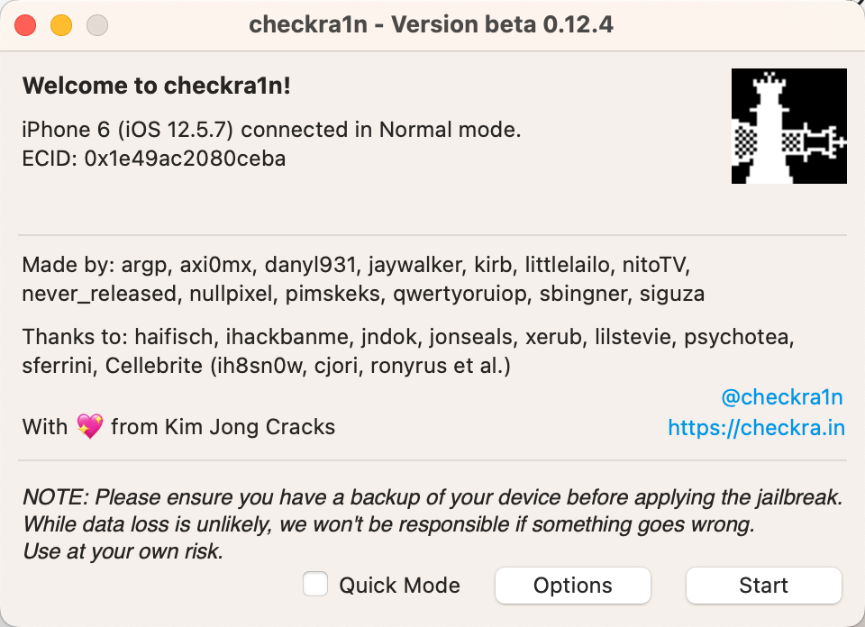

# 用checkra1n给iPhone越狱

不论是官网独立的checkra1n的app，还是爱思助手的一键越狱中的checkra1n的app，其实都是一样的使用：

都无需额外的Apple苹果账号，是可以独立去使用的。

下面就是使用checkra1n去给iPhone越狱的过程：

注：此时的，iPhone通过`USB Type-A`连接到Mac中


对于已启动checkra1n的app后，主界面中点击`Start`：



然后提示，准备好进入DFU模式：

```bash
The device needs to be put into DFU mode to apply the jailbreak. This is amanual process and we will guide you through it.In order to prevent filesystem corruption through hard reset, the device will beput into recovery mode first. Click Next when you are ready.
```


点击`Next`后，提示：

* `Enter recovery mode ...`
  * 

然后，iPhone端，出现iTunes和Lighting数据线的界面：


表示：已经进入了`Recovery Mode`=`恢复模式`

然后checkra1n中，显示：

```bash
Time to put the device into DFU mode. Locate the buttons as marked below on your device and check the instructions on the right **before** clicking Start.

-- Side button
-- Home button

1. Click Start!
2. Press and hold the side and Home buttons together (4)
3. Release the Side button BUT KEEP HOLDING the Home button (10)

Cancel Start
```


表示，要按照操作提示，去进入：`DFU`模式了

然后去操作：

* 第一步：点击`Start`
*  第二步：同时按住电源键和Home键
   * 保持大概4秒左右
   * 界面
     * 
* 第三步：释放电源键，保持继续按住Home键
  * 保持大概不到10秒
  * 注意
    * **不要2个按键都松开后，再重新按Home键**，是只松掉电源键，保持继续按住Home键！

然后就会进入刷机过程：

* Booting
  * 总体效果
    * 
      * 
  * iPhone端显示booting的细节
    * 
    * 

最后完成时显示：

* All Done
  * 
    * 

然后iPhone桌面中即可看到已安装的checkra1n了：


