# 常见问题

## `USB Type-C`口无法进入DFU模式，无法越狱

### 现象

用`USB Type-C`转Lighting闪电的USB数据线，把`iPhone6`连接到新的`Mac`（比如`Mac M2 Max`）中，然后去用checkra1n去越狱：

始终无法顺利进入DFU模式，无需继续越狱

具体现象是：

check1n进入DFU模式失败后，显示`Retry`

```bash
Whoops, the device didn't enter DFU mode. Click Retry to try again.

Retry
```

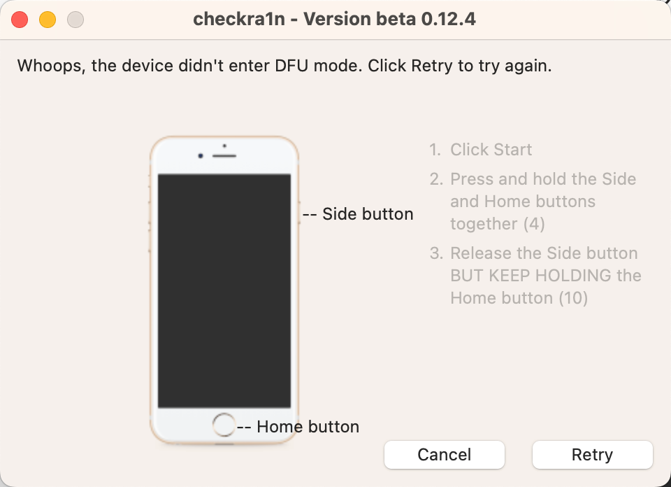

### 原因

* `USB Type-A`的USB口，才能正常进入DFU模式，才能继续越狱
  * 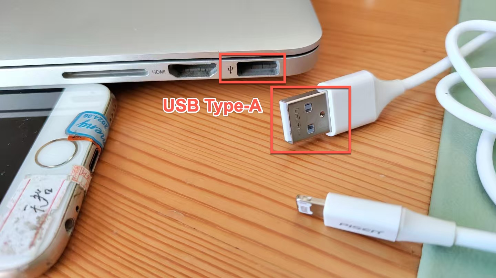
  * 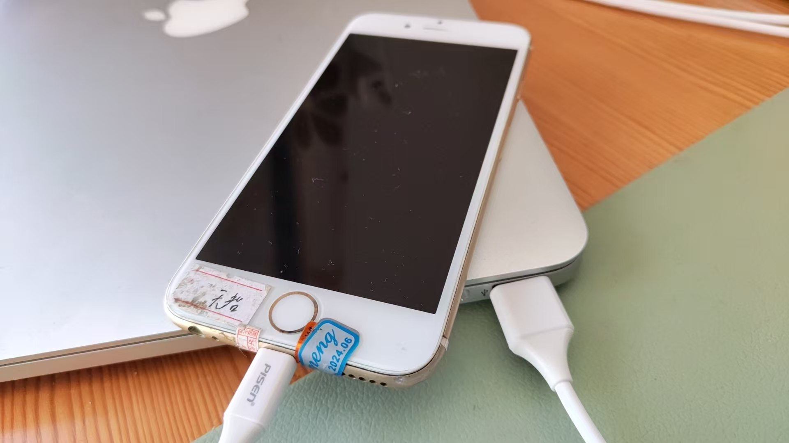
* 而`USB Type-C`的USB口，无法正常进入DFU模式，无法继续越狱
  * 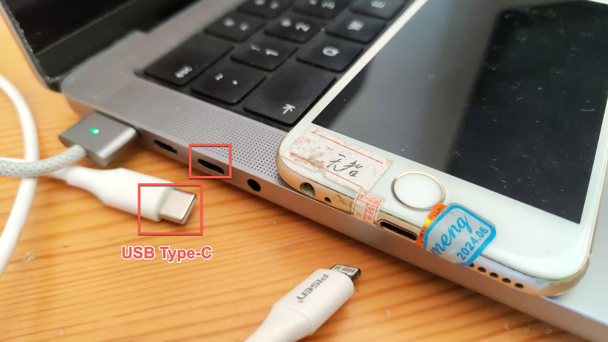
  * 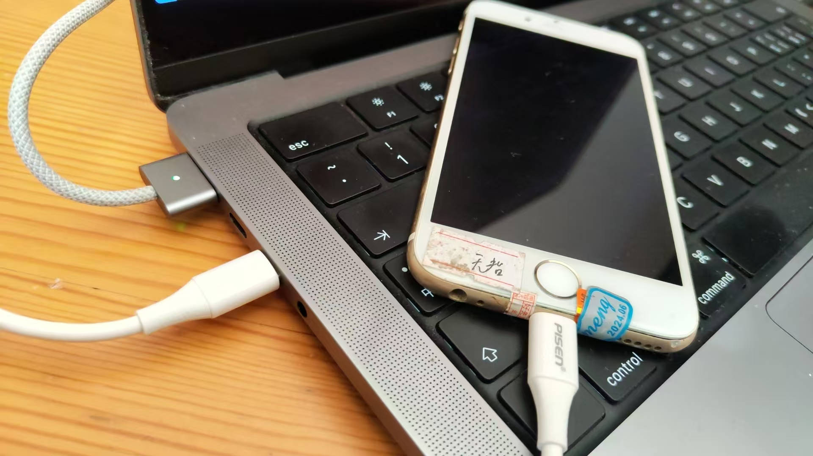

具体解释：

对于，需要进入DFU模式（恢复模式），才能继续去越狱的越狱工具，比如`checkra1n`（和另外的[palera1n](https://book.crifan.org/books/ios_re_ios15_jailbreak/website/palera1n/before/pre_condition.html)），必须使用：

**带原装的TypeA的USB口**

的（Mac/Win笔记本），才可以继续正常进入DFU模式，继续越狱

且注意：

* **即使是`USB Type-C`转`USB Type-A`的转接头=转接口，也不行**
  * 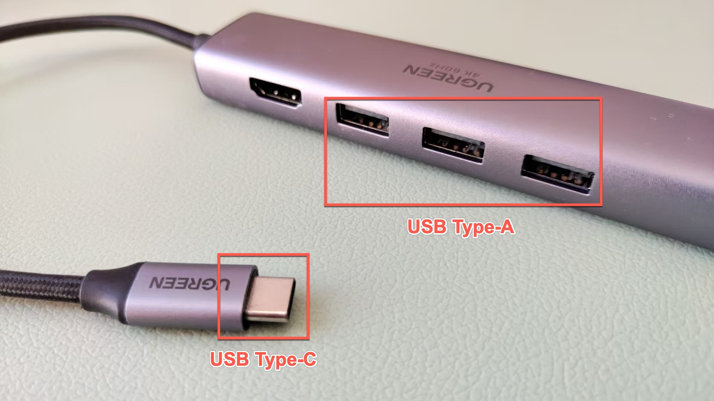

### 解决办法

换**原装的，带`USB Type-A`的USB口**（的Mac或Win电脑）

## USB Error (Error code: -10)

### 现象

（旧的，带USB TypeA口的）Mac中：

* Mac系统版本是：`macOS Big Sur` = `macOS 11.7.3`
  * 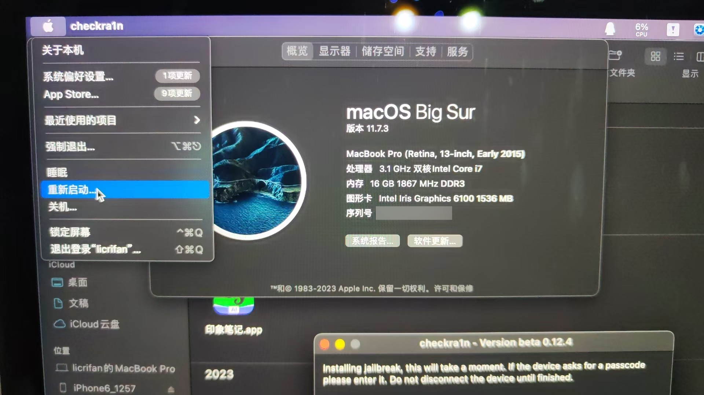

用checkra1n去给iPhone6越狱，在已经进去恢复模式，继续操作时报错：

```bash
USB Error (Error code: -10)
```

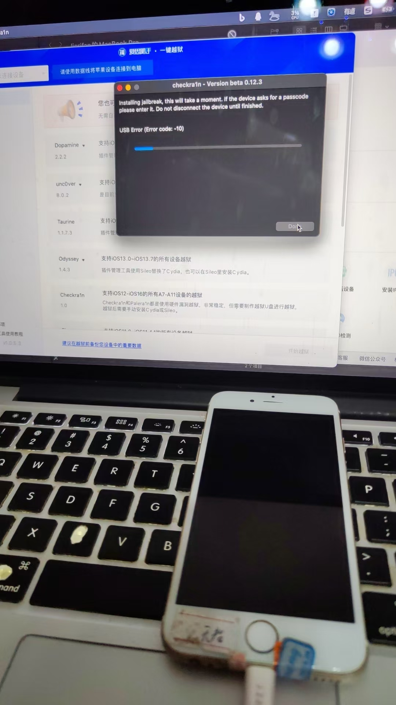

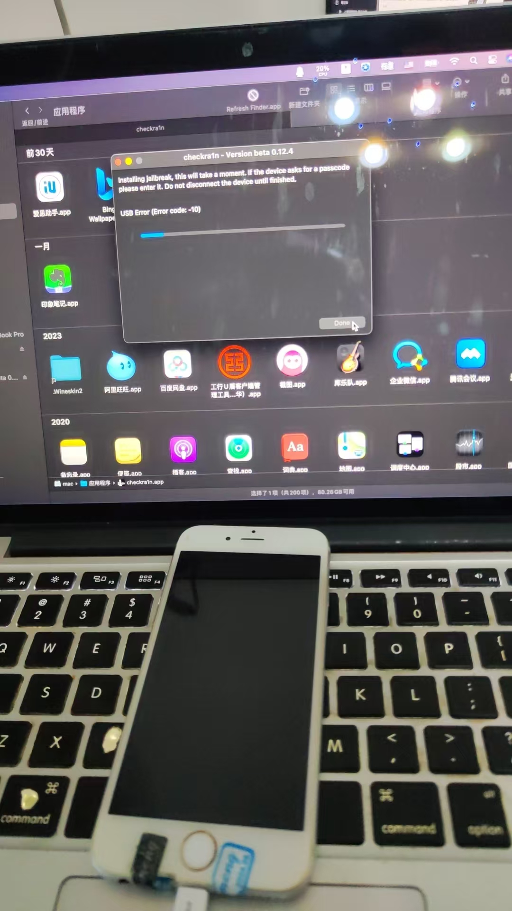

### 原因

* 原因：USB接口（供电？）等异常
  * USB口的电流异常？
  * 其他未知的诡异的问题？

### 解决办法

* 解决办法：重启Mac

### 心得

之前之所以没找到此处的最终解决办法，重启Mac

是之前的经验，Mac很少遇到，需要重启才能解决问题的情况

而使得，从来没有想到，需要重启Mac，去试试能否解决问题

所以此处的最大心得是：

（不论是Mac还是Win）电脑遇到（各种诡异的疑难杂症的）问题，实在不行，重启试试：仍是一大法宝。

## checkra1n越狱后，iPhone桌面上看不到checkra1n图标

* 现象：checkra1n越狱后，iPhone桌面上看不到checkra1n图标
  * 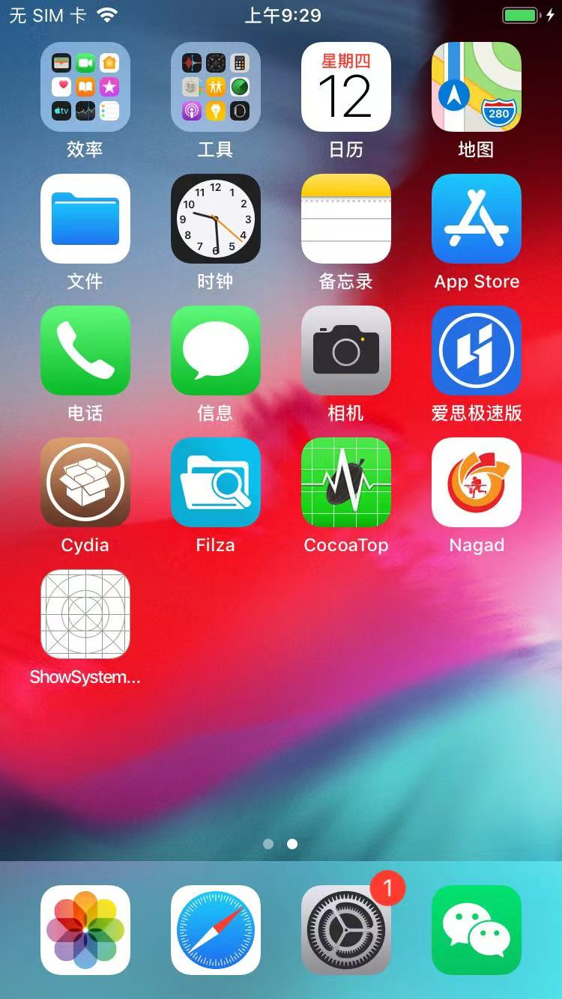
* 原因：估计是正在安装？
* 解决办法：稍微等一会（大概几十秒后），即可出现checkra1n图标
  * 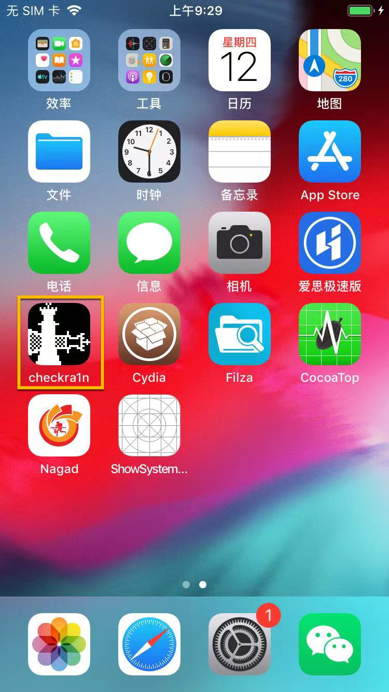

## checkra1n越狱后，点击各种越狱工具都无法正常启动

### 现象

最初安装了checkra1n后，当时桌面上看到的，各种app图标：

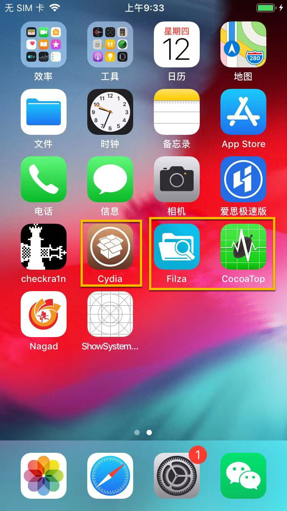

* Cydia
* Filza
* CocoaTop64

但是，点击后，都会：闪退=崩溃=无法正常启动

### 原因

此处的：Cydia、Filza、CocoaTop64等越狱工具，都是之前（正常越狱后安装的，但是现在越狱丢失了而）残留的

此时=实际上情况是：iPhone中是没有（安装）这些软件（Cydia）和插件（Filza、CocoaTop64）的

### 解决办法

对于这些越狱工具：

* Cydia：是需要后续用checkra1n去安装的
* 残留的插件（Filza、CocoaTop64）：是需要后续再单独去安装的

#### 相关

另外一个相关的现象是：

后续checkra1n中正常安装了Cydia，Cydia打开有更新，去更新各种插件后，估计是内部触发了uicache的逻辑，使得桌面上的图标刷新了

从而导致：之前残留的Filza、CocoaTop64等插件的图标，就消失了

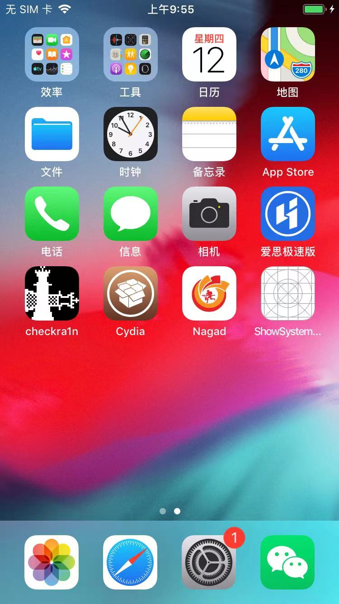
