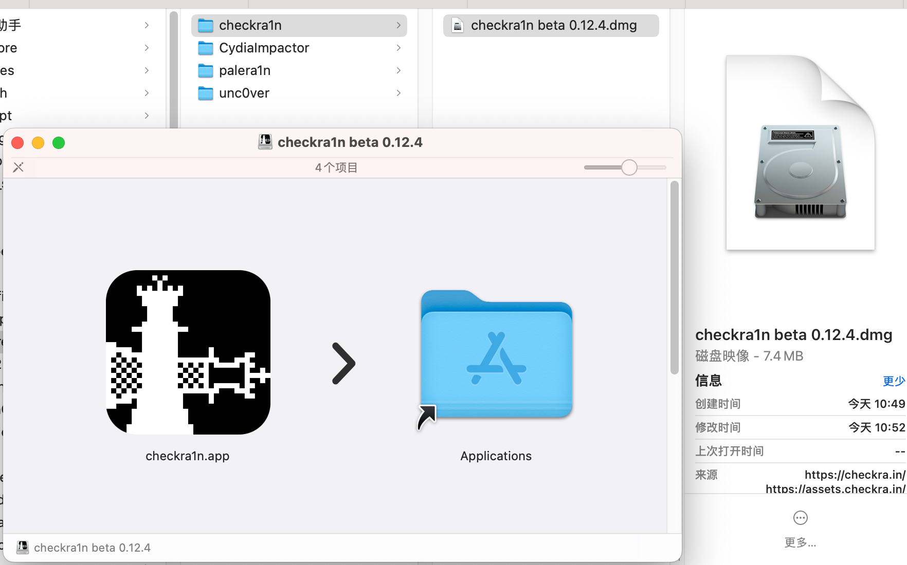
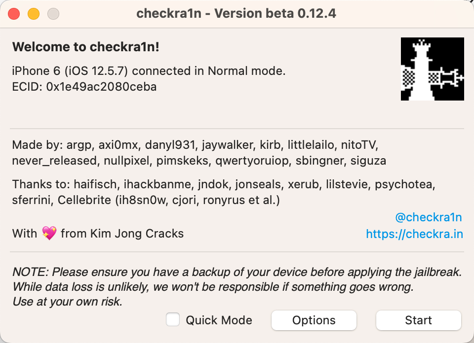
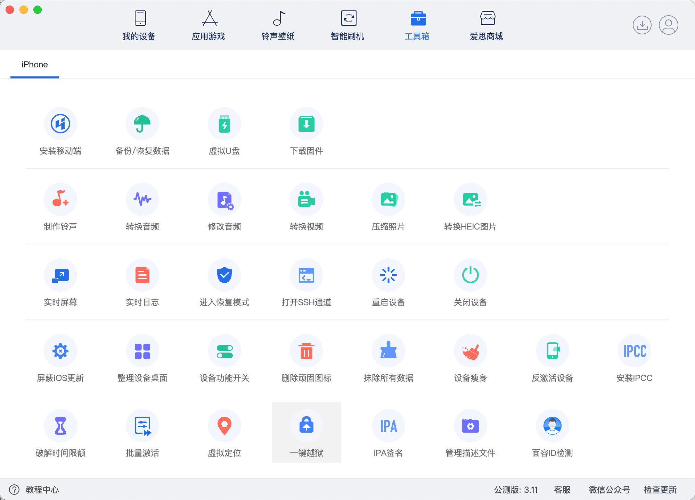
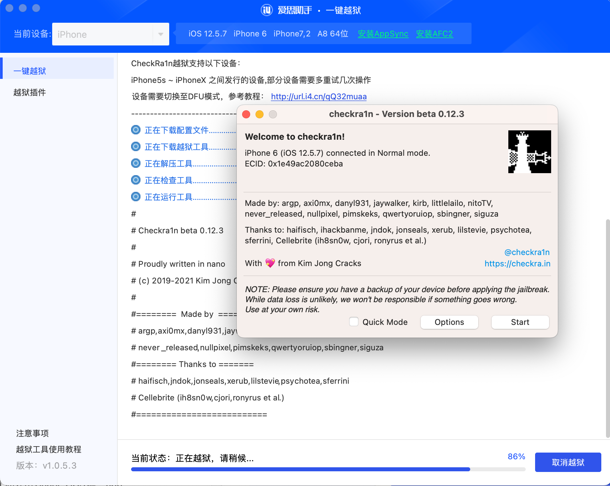

# 打开checkra1n的app

* 概述
  * 打开（Mac端的）checkra1n的app
    * checkra1n的来源（选择任一均可）
      * 方式1：[官网](https://checkra.in/)独立下载的`checkra1n`的app
      * 方式2：`爱思助手`的`一键越狱`中自带集成的`checkra1n`的app

获取和打开checkra1n的app 详解：

## 方式1：官网下载独立的checkra1n的app

去checkra1n官网：

https://checkra.in/

下载最新版：

https://checkra.in/releases/0.12.4-beta

->

https://assets.checkra.in/downloads/macos/754bb6ec4747b2e700f01307315da8c9c32c8b5816d0fe1e91d1bdfc298fe07b/checkra1n%20beta%200.12.4.dmg

得到

`checkra1n beta 0.12.4.dmg`

双击打开：

拖动安装`checkra1n.app`到Mac中的应用程序

然后双击即可打开：

* 此处是最新版：`v0.12.4`版本的`checkra1n`
  * 

## 方式2：爱思助手中一键越狱中启动checkra1n的app

也可以从`爱思助手`的`一键越狱`：

启动`一键越狱`后，选择：`checkra1n`

即可启动`checkra1n`的app：

然后后续操作步骤，和独立的checkra1n的app的操作，是一样的。
