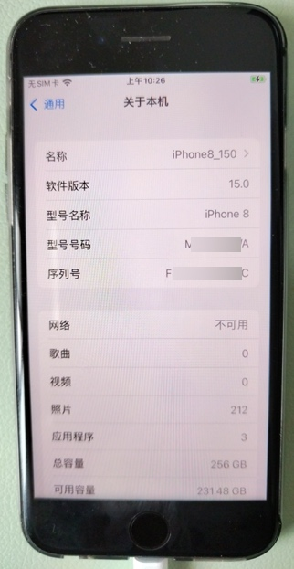

# palera1n

此处介绍：用palera1n给iOS 15.0的iPhone8越狱

* 待越狱设备
  * `iOS 15.0`, `iPhone 8`(`arm64`的`A11`)
    * 
  * 待越狱手机，已满足相关前提条件：
    * 是256GB，满足rootful越狱对空间的要求：5~10G空闲空间
    * iPhone手机的芯片是A11，是arm64
    * A11的iPhone8中已禁用passcode
    * UBS数据线是USB-A
    * 电脑是Mac（MacOS）
      * 是Intel的CPU
      * 已安装过Python3

* 此处越狱模式选择：`rootful jailbreak`=`普通越狱`=`有根越狱`

## 用palera1n给iOS 15.0的iPhone8越狱的详细过程

### 第一步：下载palera1n的二进制

此处下载：Mac的palera1n的二进制文件：

palera1n-macos-universal

https://github.com/palera1n/palera1n-c/releases/download/v2.0.0-beta.4/palera1n-macos-universal


并放到合适的目录中，比如：

`/usr/local/bin/palera1n`

此过程：

* 可以手动操作
* 也可以用命令去操作

```bash
sudo curl -Lo /usr/local/bin/palera1n https://github.com/palera1n/palera1n-c/releases/download/v2.0.0-beta.4/palera1n-macos-universal
sudo chmod +x /usr/local/bin/palera1n
```

或：

```bash
sudo mv ./palera1n-macos-universal /usr/local/bin/
mv /usr/local/bin/palera1n-macos-universal /usr/local/bin/palera1n
sudo xattr -c /usr/local/bin/palera1n
sudo chmod +x /usr/local/bin/palera1n
```

放好后，确保命令行可以找到：

```bash
> which palera1n
/usr/local/bin/palera1n
```

另外顺带去看看版本：

```bash
crifan@licrifandeMacBook-Pro  ~/dev/dev_tool/reverse_security/iOS/palera1n  palera1n --version
palera1n version 2.0.0: Wed Feb 15 08:49:44 UTC 2023; runner:v2.0.0-beta.4/RELEASE
# == palera1n-c ==
#
# Made by: Nick Chan, Ploosh, Mineek, Nebula, llsc12
#
# Thanks to: dora2ios, pythonplayer, tihmstar, nikias
# (libimobiledevice), checkra1n team (Siguza, axi0mx, littlelailo
# et al.), Procursus Team (Hayden Seay, Cameron Katri, Keto et.al)
```

### 第二步：palera1n -c -f，安装创建fakefs

然后就可以开始用palera1n去越狱了：

```bash
palera1n -c -f
```

其中：

* `-c`, `--setup-fakefs`       Setup fakefs
  * When used with -f, --fakefs, Create the new APFS volume required for rootful. Will fail if one already exists.
    * 创建fakefs
* `-f`, `--fakefs`              Boots fakefs
  * Jailbreak in rootful mode.
    * 越狱方式/类型/模式选择：普通越狱=rootful越狱


---


TODO：

继续：
【整理】用palera1n给iOS 15.0的iPhone8越狱详细过程
中的：
详细log日志：
