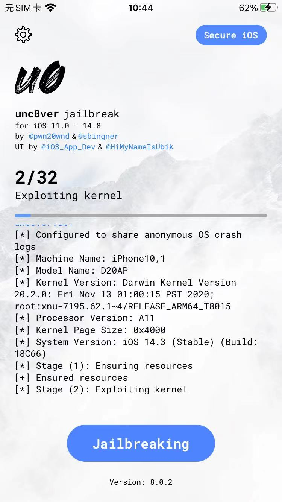
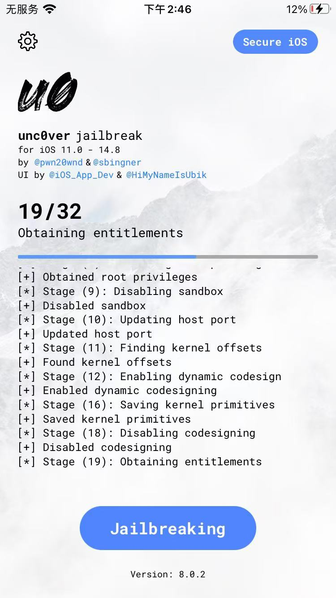
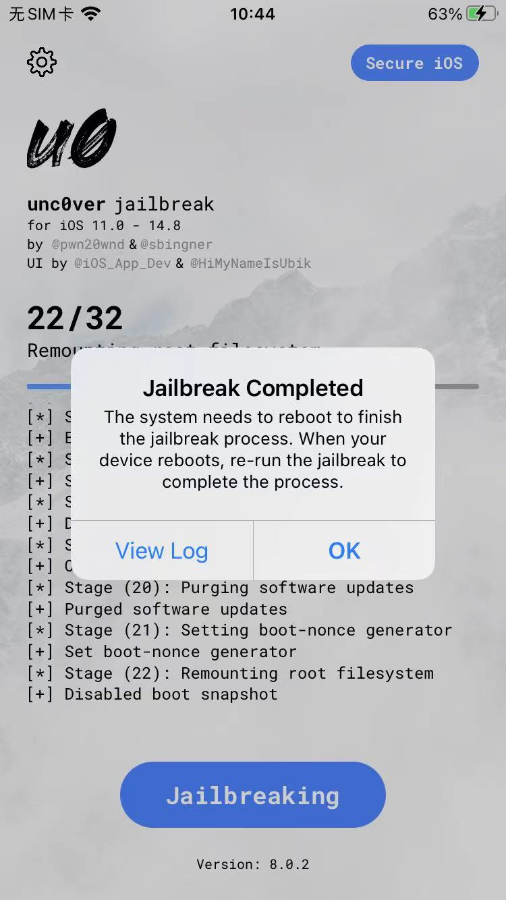
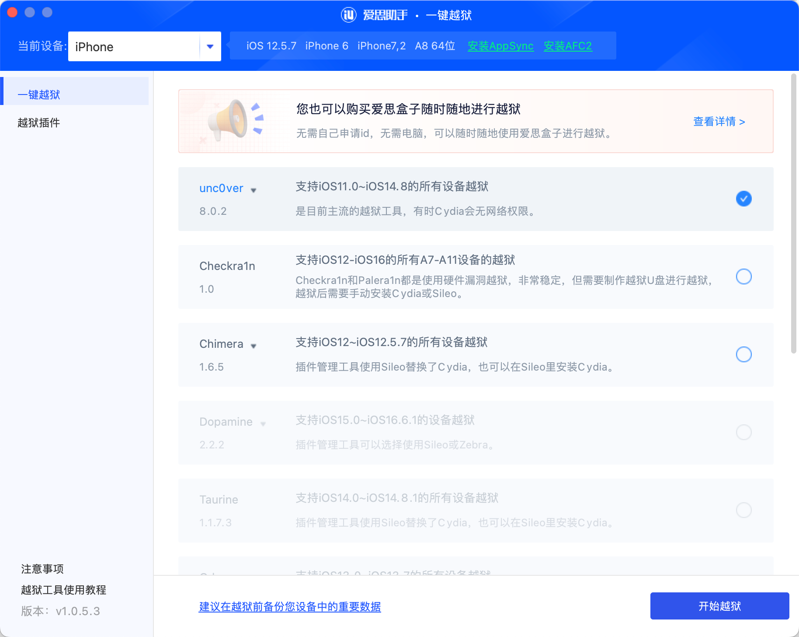
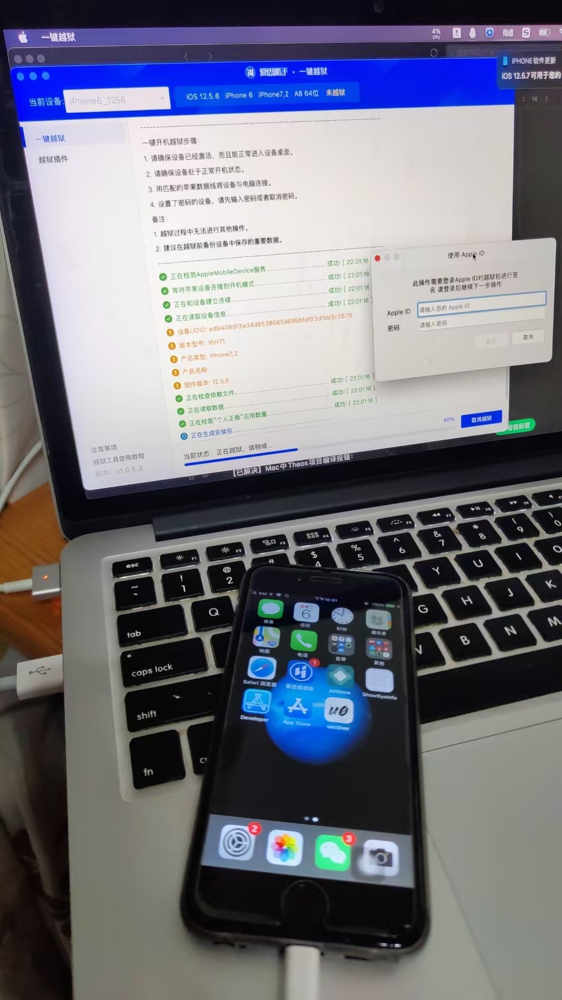
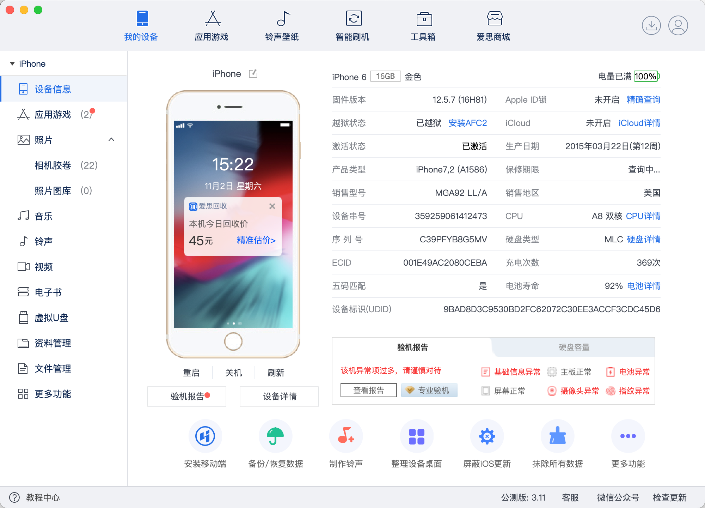
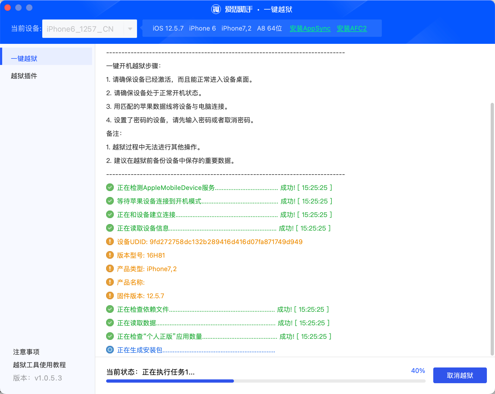
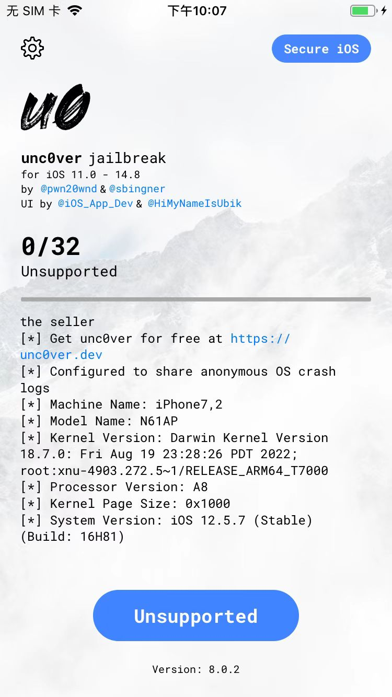

# unc0ver越狱常见问题

## unc0ver越狱期间卡死在某个界面

### 现象

用unc0ver给iPhone越狱期间，在某个步骤：

比如：

* `2/32`
  * 
* `19/32`
  * 
* `22/32`
  * 
    ```bash
    Jailbreak Completed
    The system needs to reboot to finishthe jailbreak process.When yourdevice reboots re-run the jailbreak to complete the process.
    ```

会一些出现问题：

* 卡死 = 始终没有进度 = 无法继续
* iPhone手机重启 = 无法正常越狱
* 需要重启

### 原因

未知

### 解决办法

* 先：多试几次
* 不行再：**重启iPhone**后，多试几次
* 实在不行再：**重新安装unc0ver**，再多试几次
  * 安装方式：用Sideloadly! 或 爱思助手
    * 详见：[安装unc0ver到iPhone](../../../doing_jailbreak/do_jailbreak/unc0ver/install/README.md)

## 爱思助手的一键越狱用unc0ver给iOS 12.5.7的iPhone6越狱的期间弹框会闪退

### 现象

之前Mac中用：

* `爱思助手` 的 `一键越狱`
  * 选用
    * `unc0ver` `v8.0.2`
      * 

去给`iPhone6`去越狱：

* `iOS 12.5.6`
  * 

或

* `iOS 12.5.7`
  * 

继续越狱的期间，在步骤：

* 当前状态：正在执行任务1
  * 

或：

* 当前状态：正在执行任务2
  * 

遇到问题：

当前越狱界面=弹框，会闪退

->无法继续正常越狱

### 尝试解决过程

尝试各种办法：

* 多试几次
* 换其他版本爱思助手
  * 20241102 v3.11、v3.12等最新版
  * 或更早期的各种版本
* 重新拔插USB数据线
* 换了另外一个手机：iOS 12.5.7的iPhone6
* 换了别的Mac电脑：
  * 不论是（USB Type-C接口的）新Mac：Mac M2 Max
  * 还是（USB Type-A接口的）旧Mac：Mac 2015

但都是：问题依旧。

### 原因

* 之前怀疑是
  * 最新版爱思助手的一键越狱本身有bug，导致无法（正常用unc0ver去）越狱？
    * 毕竟早期，也遇到过，当时爱思助手版本升级后，内置的一键越狱的app的版本也升级了，当时导致越狱异常，当时是：换了旧版本的爱思助手，而解决了问题
* 更可能的原因
  * `unc0ver`（即使是最新版8.0.2，也）**不支持** `iOS 12.5.6`和`iOS 12.5.7`
    * 所以导致：爱思助手，无法正常安装unc0ver到iPhone中？
    * 细节：
      * unc0ver v8.0.2中，虽然写着支持iOS的版本是：`11~14.8`
      * 但是，对于，相对特殊的 iOS `12.5.6`和`12.5.7`来说，就是无法支持
        * 注：对应的，iOS `12.5.6`和`12.5.7`这2个版本本身有点特殊，一个另外相关现象是：
          * Xcode开发iOS的插件时，选择Deployment版本时，也没有iOS 12.5（12.5.6或12.5.7）的支持
            * 但是：向上有`iOS 13.0`，向下有`iOS 12.4`的
    * 如何发现这个原因的？
      * 之前用Sideloadly安装unc0ver到iOS12.5.7的iPhone6后，发现是：
        * Unsupported
          * 
      * 才明白是，本身unc0ver，就不支持iOS 12.5.7
        * 所以，才会想到：估计爱思助手无法安装unc0ver到iPhone中，或许是这个原因
