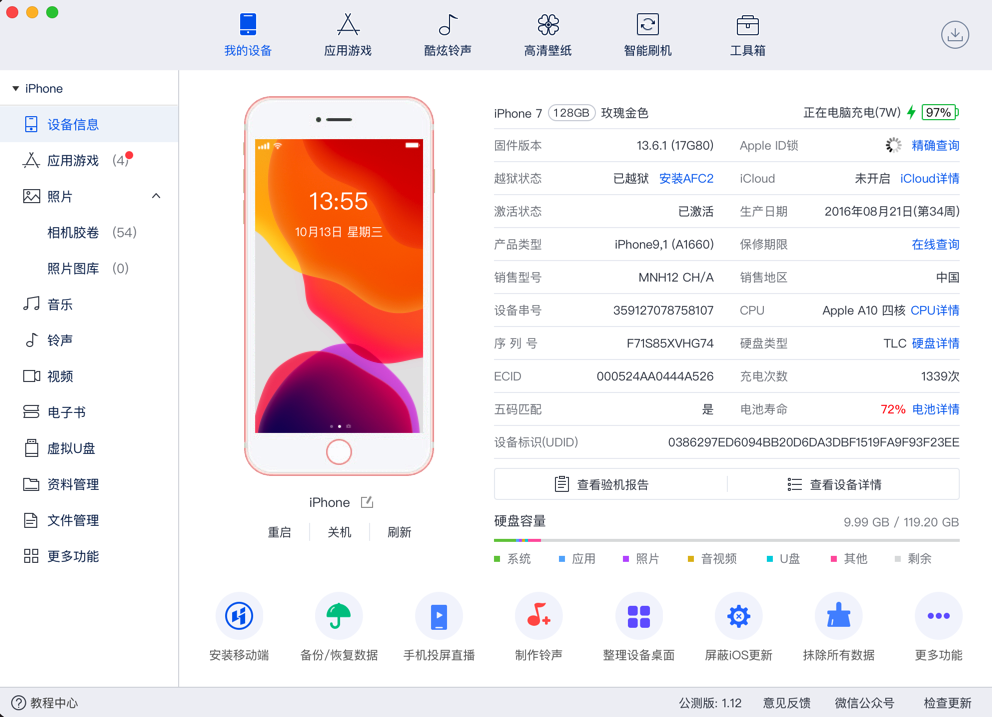
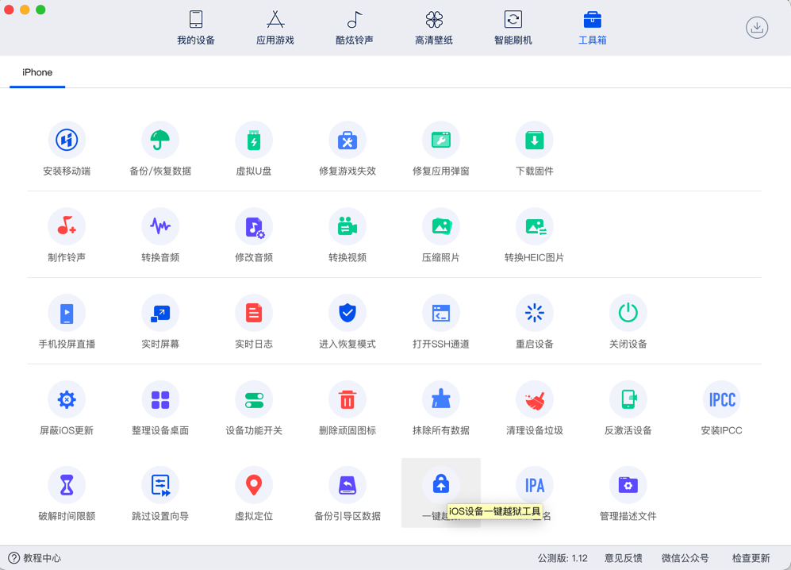
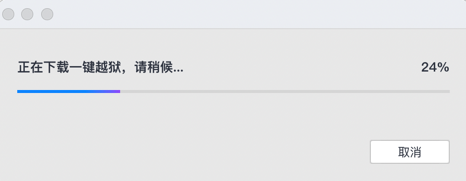
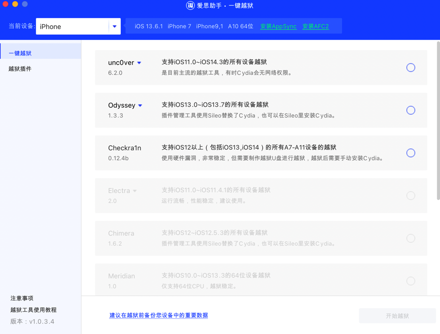
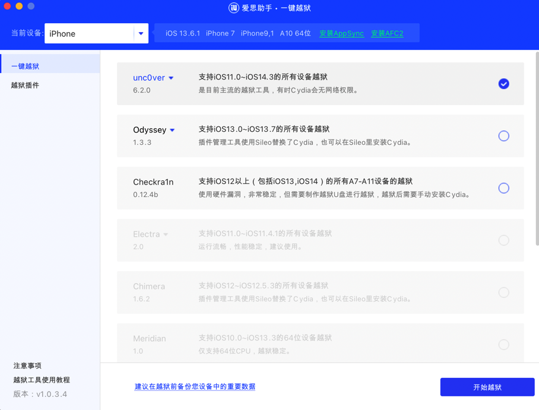
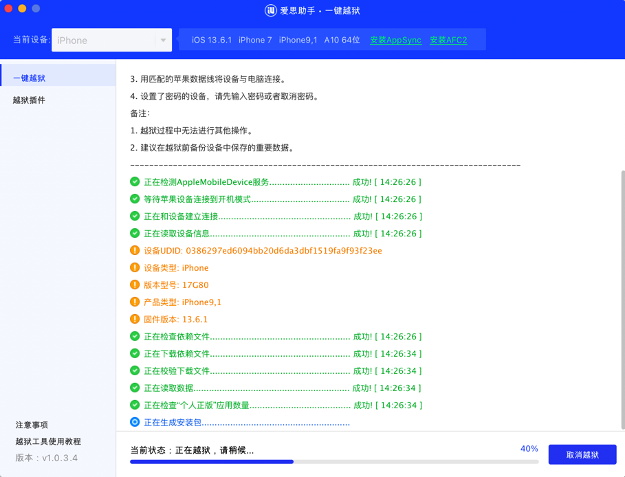
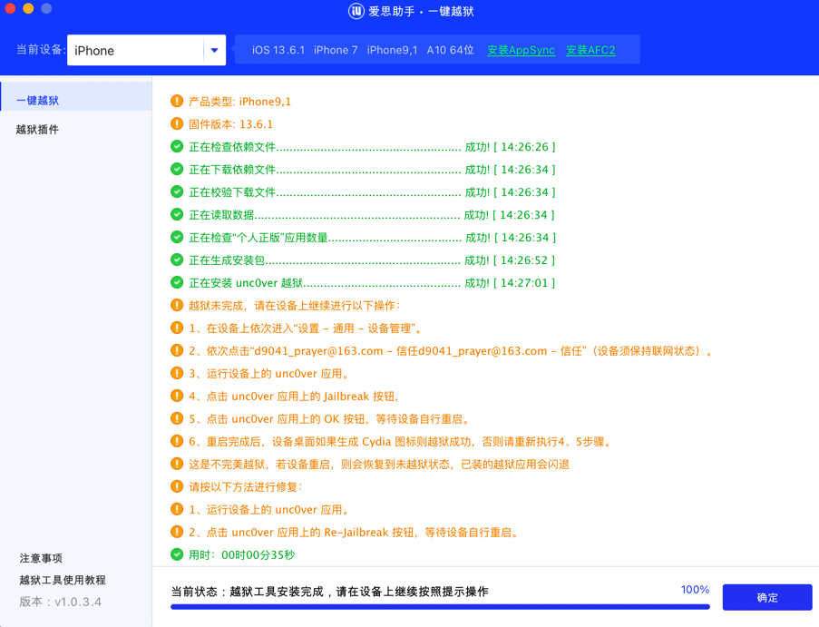

# 用爱思助手安装unc0ver到iPhone中

此处介绍，如何用爱思助手安装unc0ver到iPhone中：

Mac中，打开爱思助手，能检测到iOS 13.6.1的iPhone7：



找到：`工具箱`->`一键越狱`：



首次使用时，会先去下载`一键越狱`：



下载完毕后，自动启动`一键越狱`：



勾选用：unc0ver，点击`开始越狱`：



即可开始安装unc0ver到iPhone的过程：







## 附录

相关日志

```log
----------------------------------------------------------------------------------
一键开机越狱支持以下设备及版本：
所有iOS版本为 8.x / 9.x / 10.x / 11.x / 12 ~ 13.3 的苹果设备。
----------------------------------------------------------------------------------
一键开机越狱步骤：
1. 请确保设备已经激活，而且能正常进入设备桌面。
2. 请确保设备处于正常开机状态。
3. 用匹配的苹果数据线将设备与电脑连接。
4. 设置了密码的设备，请先输入密码或者取消密码。
备注：
1. 越狱过程中无法进行其他操作。
2. 建议在越狱前备份设备中保存的重要数据。
----------------------------------------------------------------------------------
正在检测AppleMobileDevice服务...............................    成功! [ 14:26:26 ]
等待苹果设备连接到开机模式......................................    成功! [ 14:26:26 ]
正在和设备建立连接...................................................    成功! [ 14:26:26 ]
正在读取设备信息......................................................    成功! [ 14:26:26 ]
设备UDID: 0386297ed6094bb20d6da3dbf1519fa9f93f23ee
设备类型: iPhone
版本型号: 17G80
产品类型: iPhone9,1
固件版本: 13.6.1
正在检查依赖文件......................................................    成功! [ 14:26:26 ]
正在下载依赖文件......................................................    成功! [ 14:26:34 ]
正在校验下载文件......................................................    成功! [ 14:26:34 ]
正在读取数据............................................................    成功! [ 14:26:34 ]
正在检查“个人正版”应用数量.......................................    成功! [ 14:26:34 ]
正在生成安装包.........................................................    成功! [ 14:26:52 ]
正在安装 unc0ver 越狱..............................................    成功! [ 14:27:01 ]
越狱未完成，请在设备上继续进行以下操作：
1、在设备上依次进入“设置 - 通用 - 设备管理”。
2、依次点击“d9041_prayer@163.com - 信任d9041_prayer@163.com - 信任”（设备须保持联网状态）。
3、运行设备上的 unc0ver 应用。
4、点击 unc0ver 应用上的 Jailbreak 按钮，
5、点击 unc0ver 应用上的 OK 按钮，等待设备自行重启。
6、重启完成后，设备桌面如果生成 Cydia 图标则越狱成功，否则请重新执行4、5步骤。
这是不完美越狱，若设备重启，则会恢复到未越狱状态，已装的越狱应用会闪退
请按以下方法进行修复：
1、运行设备上的 unc0ver 应用。
2、点击 unc0ver 应用上的 Re-Jailbreak 按钮，等待设备自行重启。
用时：00时00分35秒
```

后续即可转去：

[使用unc0ver去越狱](../../../../../doing_jailbreak/do_jailbreak/unc0ver/use/README.md)
