# 用Sideloadly安装unc0ver到iPhone中

概述：

* 下载`unc0ver`的`ipa`文件
  * unc0ver `v8.0.2`
    * https://unc0ver.dev/downloads/8.0.2/9e44edfbfd1905cadf23c3b9ad1d5bed683ce061/unc0ver_Release_8.0.2.ipa
* 用`Sideloadly!`去安装（`unc0ver`到`iPhone`中）
  * 图
    * 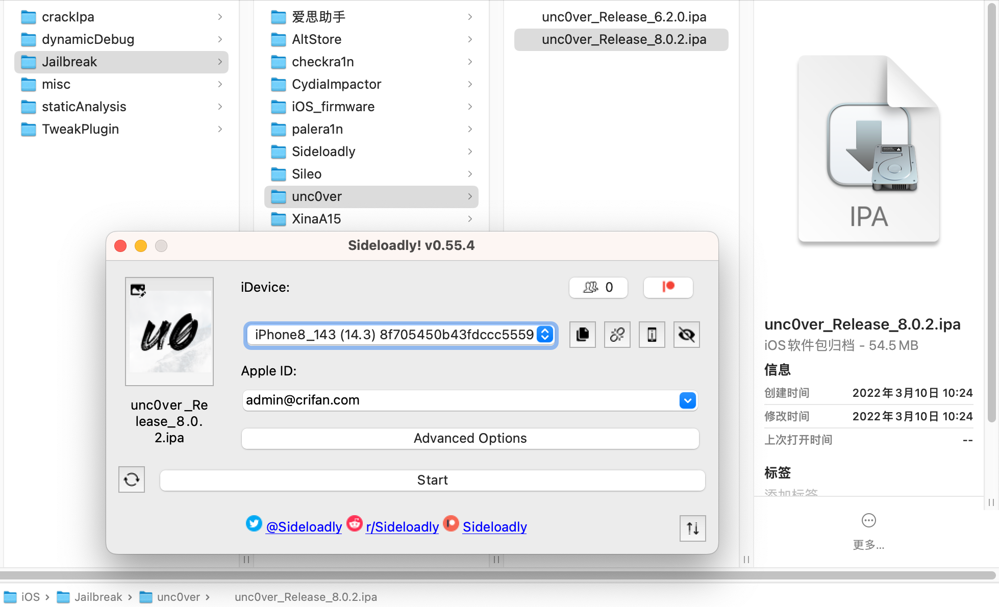
  * 核心思路
    * 用你给的Apple账号，去获取对应的ID，用于给unc0ver去重新签名，然后上传Upload到iPhone中，再去安装Install，即可

## 详解

### 下载unc0ver的ipa

去unc0ver的官网：

https://unc0ver.dev/

去下载unc0ver的ipa文件

目前（20241224）最新的版本是`v8.0.2`的：

https://unc0ver.dev/downloads/8.0.2/9e44edfbfd1905cadf23c3b9ad1d5bed683ce061/unc0ver_Release_8.0.2.ipa

#### 历史版本

* v8.0.2, 2021/12/30
  * https://unc0ver.dev/downloads/8.0.2/9e44edfbfd1905cadf23c3b9ad1d5bed683ce061/unc0ver_Release_8.0.2.ipa
* v8.0.1, 2021/12/30
  * https://unc0ver.dev/downloads/8.0.1/076aeba87b437a6e3e13aaf62d256888929eb70c/unc0ver_Release_8.0.1.ipa
* v8.0.0, 2021/12/30
  * https://unc0ver.dev/downloads/8.0.0/83c16266696b792b0988e0e2d8908ab99b426fe6/unc0ver_Release_8.0.0.ipa
* v7.0.2, 2021/10/31
  * https://unc0ver.dev/downloads/7.0.2/11c3f7b0eea806ba3cac975f74dcc2cc4e916bac/unc0ver_Release_7.0.2.ipa
* v7.0.1, 2021/10/29
  * https://unc0ver.dev/downloads/7.0.1/4f30bccf1fe1d24f2764f0e78dc12c67bbd002d6/unc0ver_Release_7.0.1.ipa
* v7.0.0, 2021/10/22
  * https://unc0ver.dev/downloads/7.0.0/48073ecf35dcf43d0607ec779079e8a4d69e90c2/unc0ver_Release_7.0.0.ipa

等等。

### 下载安装Sideloadly

先去官网下载：

* [Sideloadly - iOS, Apple Silicon & TV Sideloading](https://sideloadly.io/)
  * https://sideloadly.io/SideloadlySetup.dmg

得到：`SideloadlySetup.dmg`，然后双击去安装`Sideloadly`：

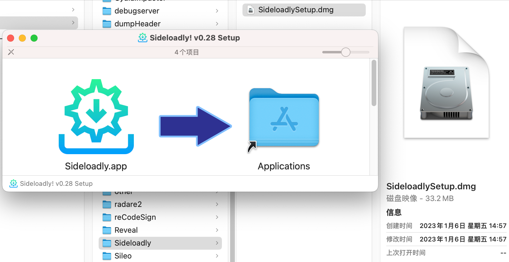

### 使用Sideloadly安装unc0ver到iPhone

安装后启动`Sideloadly`，其会自动更新到最新版本，主界面是：

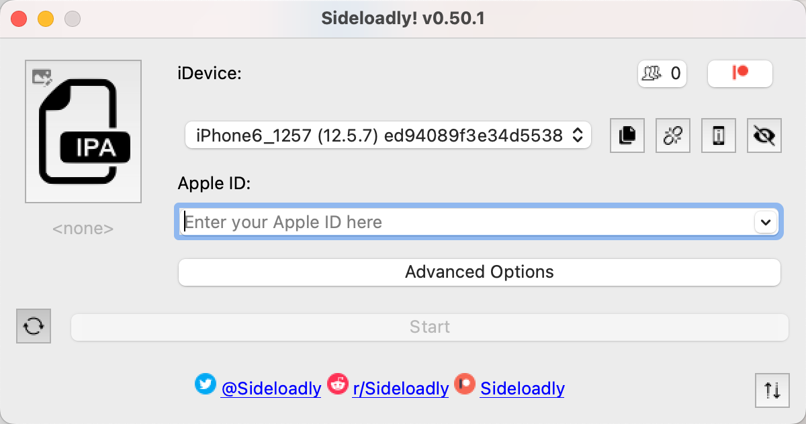

然后：

* `iDevice`中：选择你要安装的iPhone
  * 如果有多个iPhone同时连接到当前Mac的话
* `Apple ID`中：输入你的`Apple账号`

此时是：

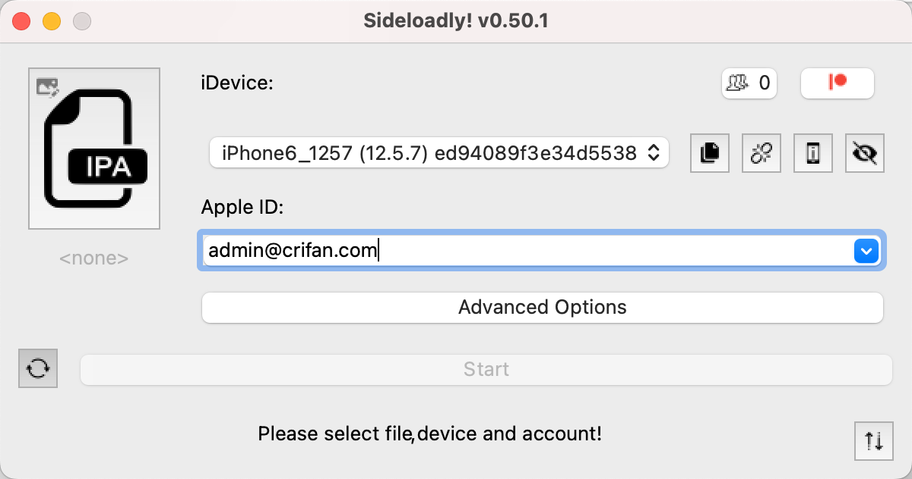

再去把之前已下载的unc0ver的ipa: `unc0ver_Release_8.0.2.ipa`：

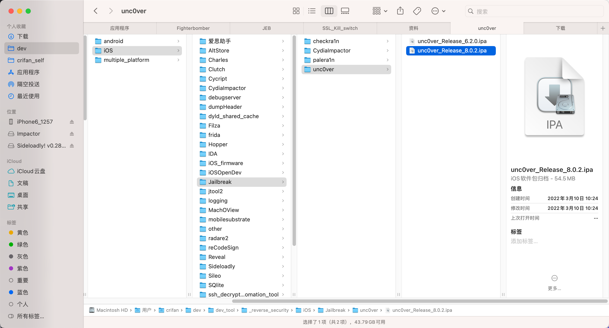

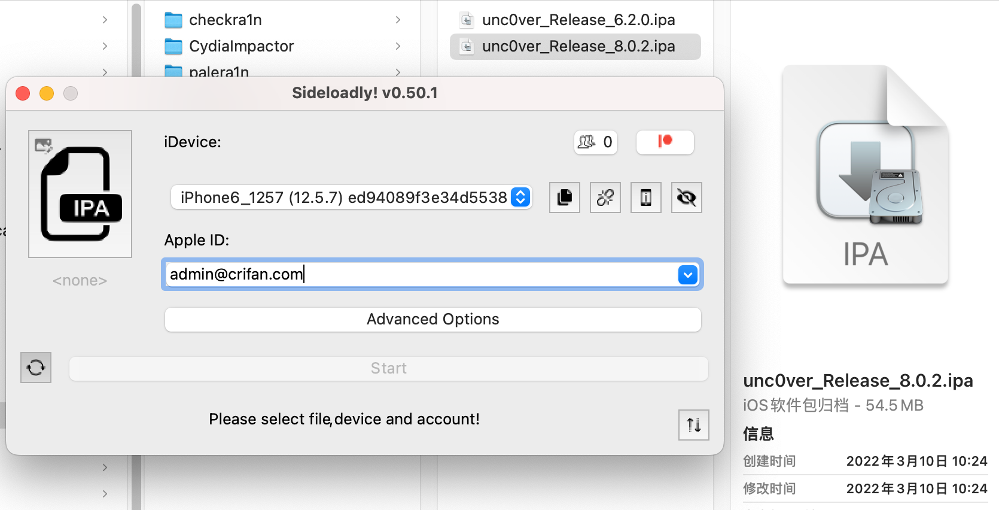

拖动到左边的IPA的图标的位置：

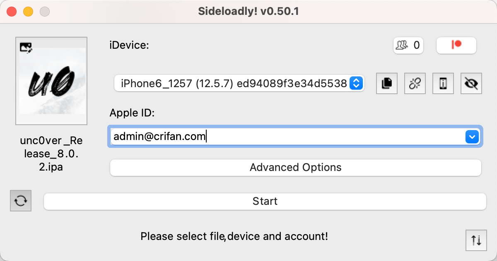

点击Start，即可开始安装的详细过程：

* Obtaining team ID
  * 此时需要输入Apple账号的密码：
    * 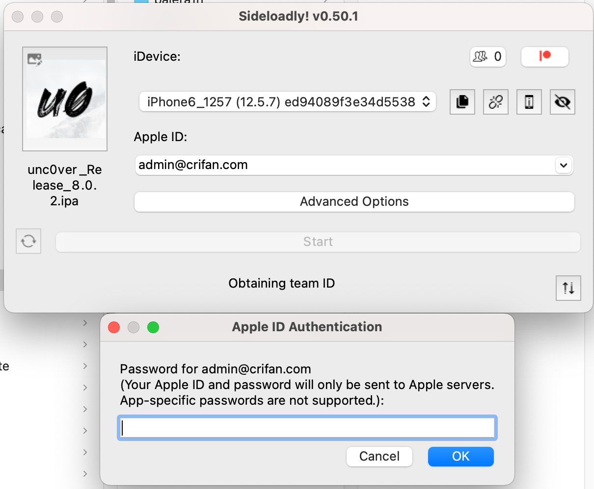
* Generating keypair
  * 
* Using app ID xxx with id yyy
  * 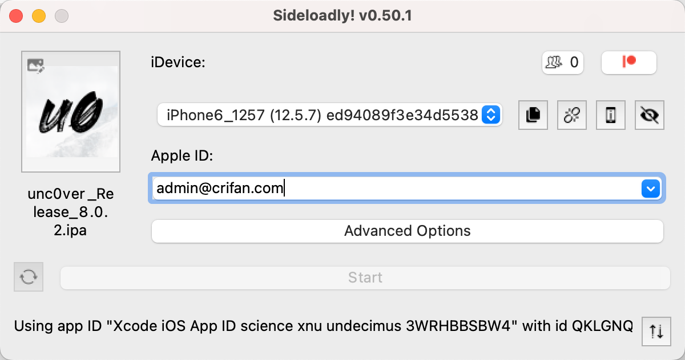
* Signing
  * 
* Uploading
  * 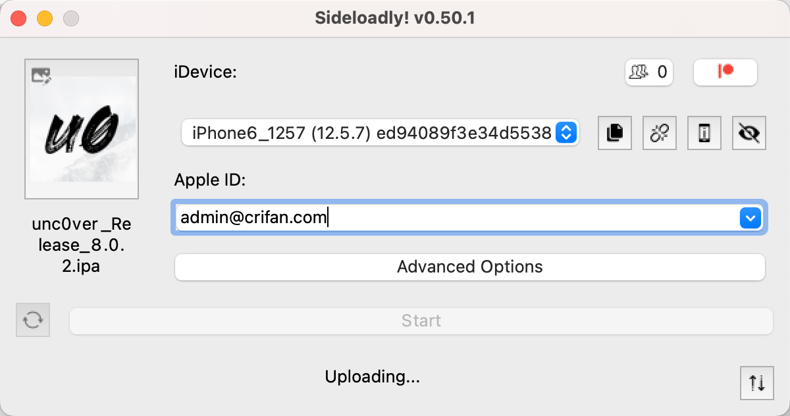
* Installing
  * Installing 15%: ExtractingPackage
    * 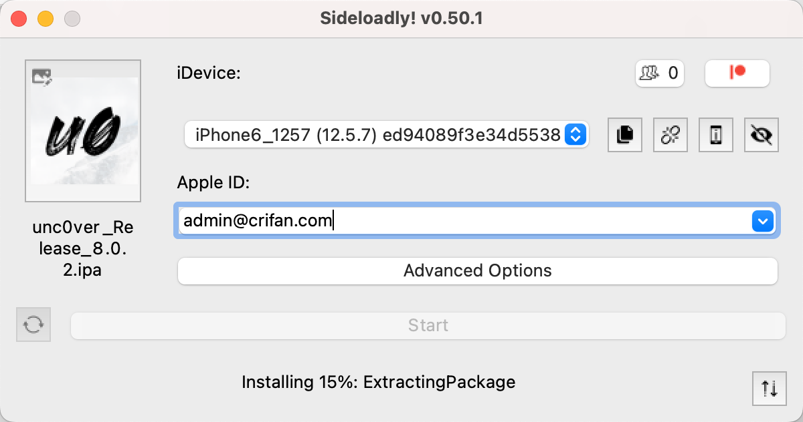
  * Installing 30%: PreflightingApplication
    * 
  * Installing 40%: VerifyingApplication
    * 
  * Installing 100%: Complete
    * 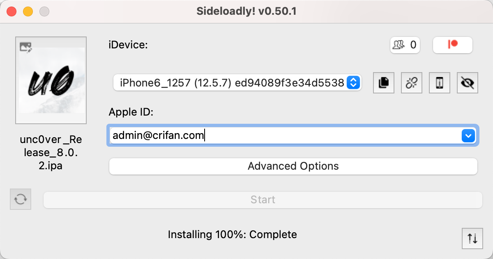
* Done
  * 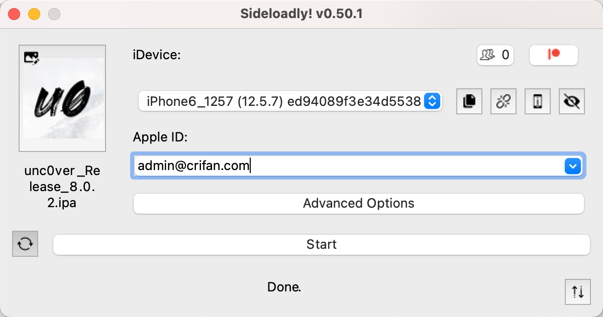

然后，iPhone6中就出现，安装好的unc0ver=桌面上可以看到unc0ver的图标了：

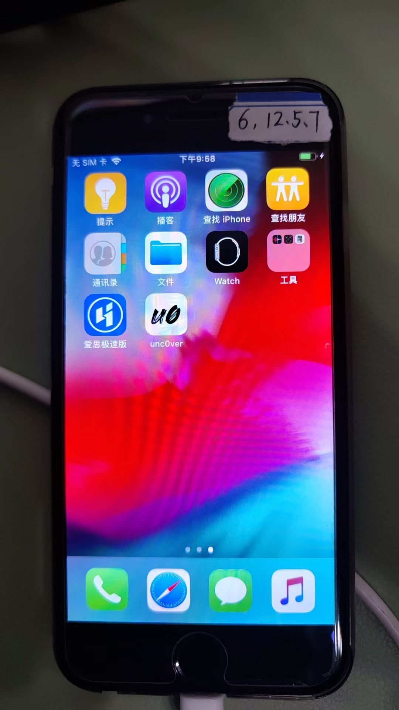
