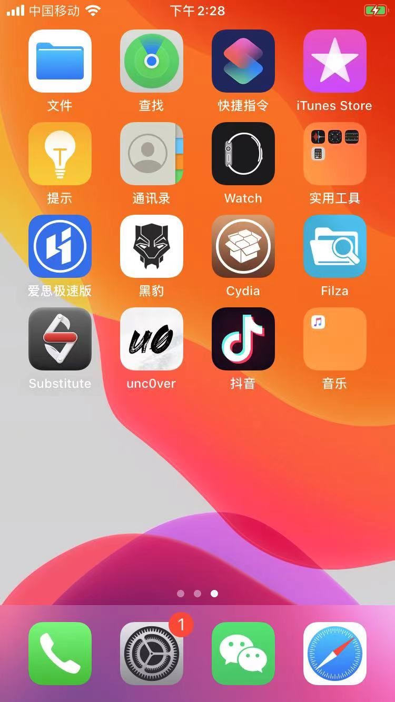
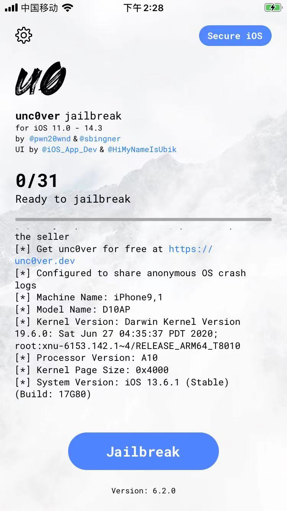
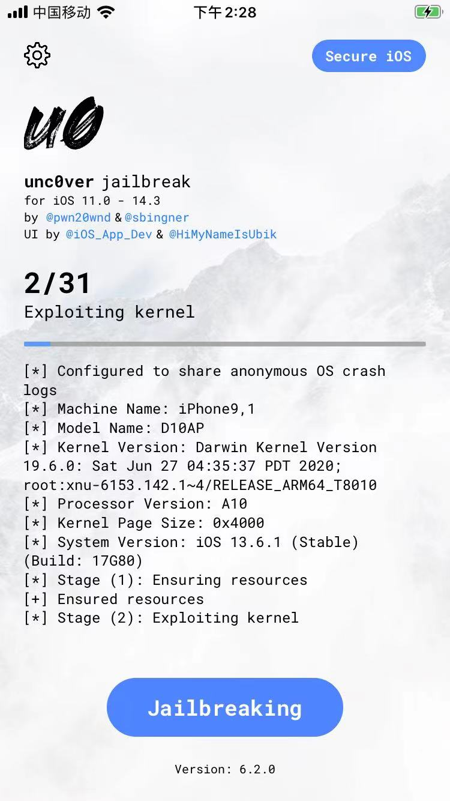
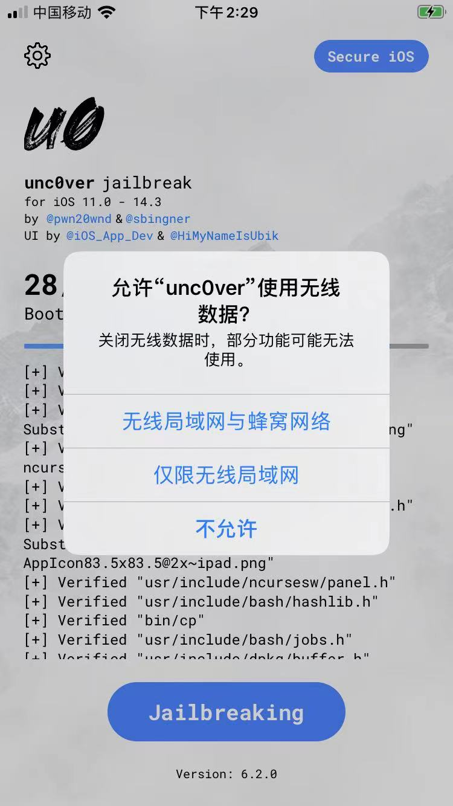
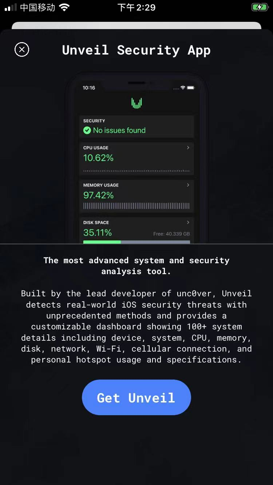
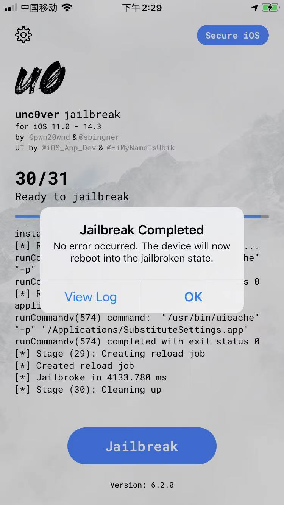
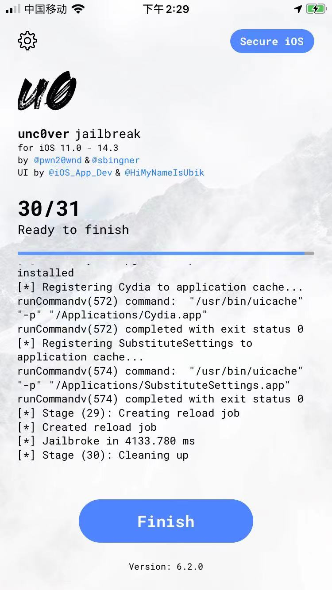

# 用unc0ver 6.0.2给iOS 13.6.1的iPhone7越狱

详解：

点击iPhone7桌面中的unc0ver：



启动进入主页面：



此处是：

* iPhone7
  * Machine Name：iPhone9,1
  * Model Name: D10AP
  * Kernel Version: Darwin Kernel Version 19.6.0: Sat Jun 04:35:37 PDT 2020;
    * root: xnu-6153.142.1~4/RELEASE_ARM64_T8010
  * Processor Version: A10

界面上显示：

```bash
[*] unc0ver is not for sale
[*] If you purchased unc0ver, please report the seller
[*] Get unc0ver for free at https://unc0ver.dev
[*] Configured to share anonymous OS crash logs
[*] Machine Name: iPhone9,1
[*] Model Name: D10AP
[*] Kernel Version: Darwin Kernel Version 19.6.0: Sat Jun 27 04:35:37 PDT 2020; root:xnu-6153.142.1~4/RELEASE_ARM64_T8010
[*] Processor Version: A10
[*] Kernel Page Size: 0x4000
[*] System Version: iOS 13.6.1 (Stable) (Build: 17G80)
```

点击`Jailbreak`，开始越狱：

变成：Jailbreaking，正在越狱



此处是在：

```bash
[*] Stage (2): Exploiting kernel
```

等待了很久。

后来出现：



允许unc0ver使用无线数据？

点击 无线局域网与蜂窝网络

直到出现：

* `Get Unveil`界面
  * 图
    * 
  * 说明
    * 只是一个广告推广页面

点击左上角的x按钮，去关闭，即可

继续等待一段时间（大概几十秒到3分钟左右）

提示越狱成功：

* `Jailbreak Completed`
  * 

此时：

* 点击OK
* 点击View Log，可以查看日志 -》 然后继续点击：Finish
  * 

-》 iPhone会自动重启，重启后，就是：越狱完成了
