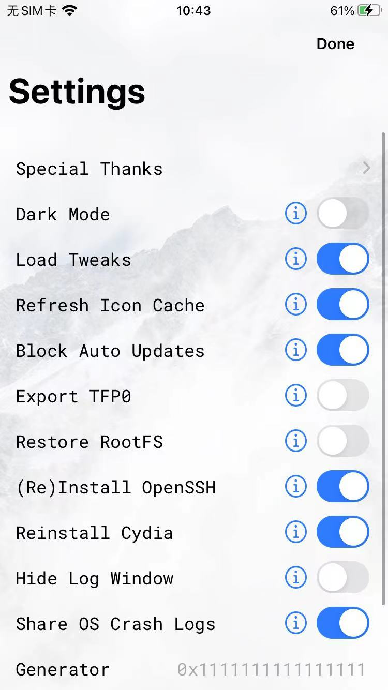

# unc0ver设置选项

此处贴出另外一次，iOS14.3的iPhone8中用unc0ver去越狱的时候，点击unc0ver左上角的设置图标，进入的设置界面：

* `unc0ver`参数详解
  * Dark Mode
  * `Load Tweaks`=加载插件
    * 越狱后，自动加载插件？
  * `Refresh Icon Cache`=刷新图标缓存
    * 防止桌面图标出现异常情况
      * 部分app已卸载 -》却还残留图标
      * 部分app已安装 -》 但是桌面上却没出现图标
    * -》刷新图标缓存后，就可以避免上述异常情况了
  * `Block Auto Updates`=禁止自动升级
    * iOS系统版本如果自动升级，往往会导致越狱丢失
      * 所以一般iOS越狱后，都希望是：禁用iOS系统自动升级（到更新版本的iOS）
  * `Export TFP0`
  * `Restore RootFS`=恢复根文件系统
    * 指的是，重新卸载掉unc0ver，恢复之前没越狱的时候的文件系统 == 卸载越狱 = 还原系统
    * 说明：
      * 正常用unc0ver去越狱时，肯定不要选择这个选项
      * 当你想要卸载越狱还原系统时，才勾选这个选项
        * 详见
          * [unc0ver卸载还原越狱](../../../../../after_jailbreak/unc0ver/restore.md)
  * `(Re)Install OpenSSH`=（重新）安装OpenSSH
    * `OpenSSH`是ssh的插件，最常用的基础插件之一
      * 安装后，后续可以用ssh去操作和访问iPhone
    * 一般建议勾选上
  * `Reinstall Cydia`=重新安装Cydia
    * 如果Cydia有问题，可以顺带去重新安装
    * 如果本身没安装Cydia，则可以用unc0ver越狱后，同时安装上Cydia
      * 注：[Cydia](https://book.crifan.org/books/ios_re_package_manager/website/cydia/)是早期最常用的包管理器之一，可以用来安装和管理各种越狱插件
  * Hide Log Window=隐藏日志窗口
  * Share OS Crach Logs=共享操作系统崩溃日志
    * 万一用unc0ver越狱失败或出现其他系统崩溃等问题，可以方便去查看相关日志，找到原因
  * Generator: `0x1111111111111111`
